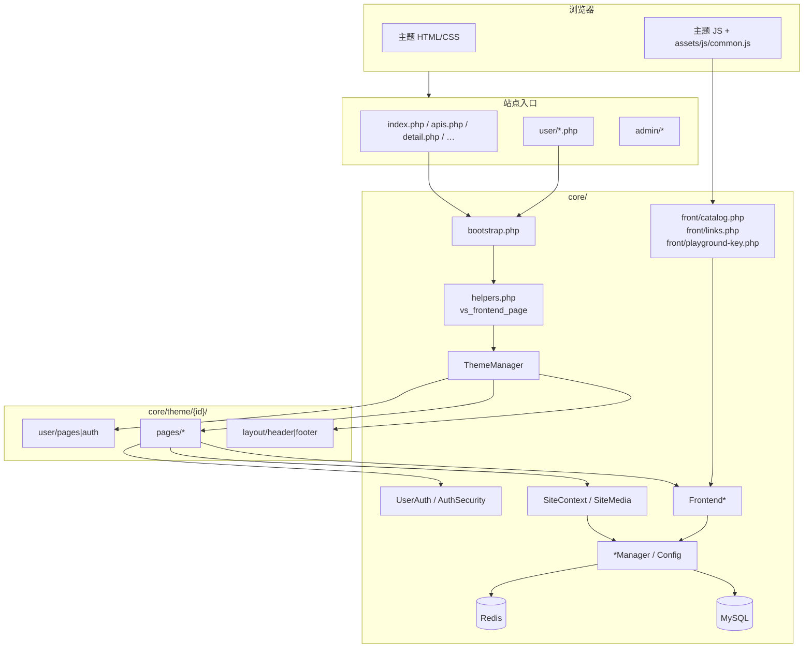
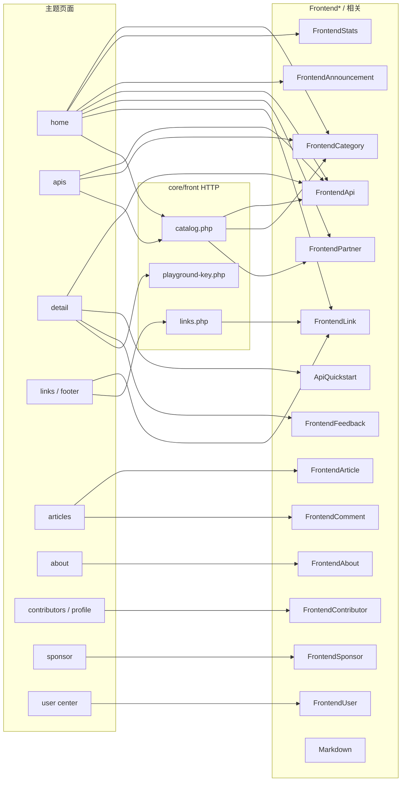
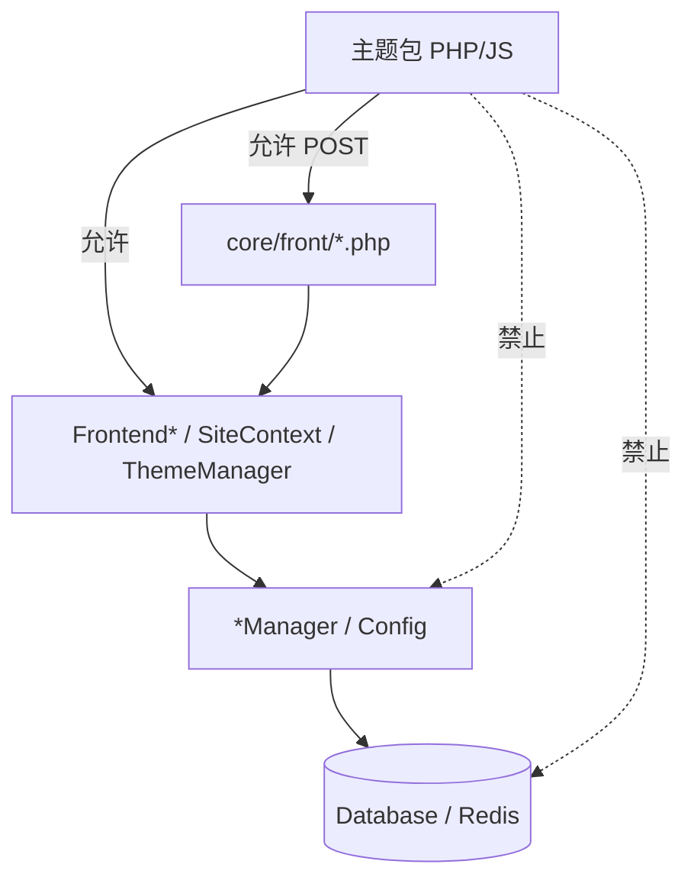
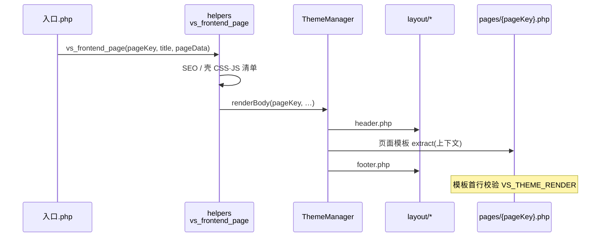
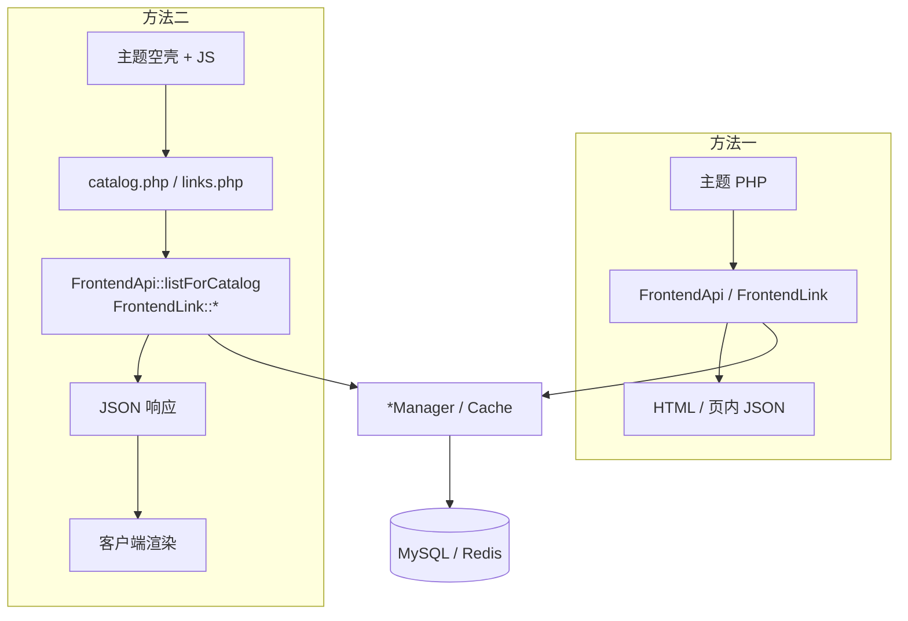

# ApiNexus · CORE 与主题包对接说明

> **路径：** 项目根目录 `CORE模块说明.md`  
> **性质：** 核心运行时（`core/`）与主题包（`core/theme/{id}/`）的对接规范与 API 参考  
> **版本：** **13.26.45**（与 `core/version.php` 中 `VS_VERSION` 一致）  
> **读者：** 自研主题作者、二次开发、核心维护者  

---

## 目录

1. [文档定位与铁律](#1-文档定位与铁律)
2. [系统分层与职责边界](#2-系统分层与职责边界)
3. [架构总图](#3-架构总图)
4. [请求与渲染链路](#4-请求与渲染链路)
5. [主题包结构与页面映射](#5-主题包结构与页面映射)
6. [主题可调用 API 速查](#6-主题可调用-api-速查)
7. [公开目录与友链：方法一 / 方法二](#7-公开目录与友链方法一--方法二)
8. [Frontend\* 模块说明](#8-frontend-模块说明)
9. [基础设施、认证与注册](#9-基础设施认证与注册)
10. [Manager 层与主题边界](#10-manager-层与主题边界)
11. [HTTP 入口（`core/front` 等）](#11-http-入口corefront-等)
12. [支付 / 验证码 / OAuth 摘要](#12-支付--验证码--oauth-摘要)
13. [升级与迁移（维护者）](#13-升级与迁移维护者)
14. [对接验收清单](#14-对接验收清单)
15. [相关文档](#15-相关文档)
16. [附录 A · core 文件索引](#附录-a--core-文件索引不含-theme-包)
17. [附录 B · 逐文件 API 参考](#附录-b--逐文件-api-参考)

---

## 1. 文档定位与铁律

### 1.1 核心与主题的关系

| 组件 | 路径 | 职责 |
|------|------|------|
| **核心运行时** | `core/*.php` 及子目录 | 数据访问、业务规则、权限校验、缓存、安全头、公开 HTTP JSON 入口 |
| **主题包** | `core/theme/{主题id}/` | 视图（HTML/CSS/JS）：布局、排版、交互；通过核心已暴露的 API 取数并展示 |
| **站点入口** | 根目录 `index.php`、`apis.php`、`user/*`、`admin/*` 等 | `require bootstrap` 后调度到主题或后台 |

**一句话：** 核心提供可对接的 PHP API 与约定 HTTP 端点；主题是展示层客户端，不实现业务规则、不直连存储。

### 1.2 铁律：主题包禁止直连数据库

**条文：** 主题包内 **禁止** 出现 `Database::`、原始 SQL、表名、字段名、PDO / mysqli，以及任何绕过核心直接访问 MySQL / Redis 业务键的写法。

**原因（安全）：**

1. **注入面扩大。** 主题由站长或第三方编写，质量不可控。若主题内拼接 SQL / 直接读请求参数进查询，攻击者可通过前台页面参数完成 **SQL 注入**，直接读写业务库。
2. **权限与审核规则被绕过。** 核心 `Frontend*` 已统一过滤「仅已审核 / 已启用 / 字段脱敏」等规则。主题直连库等于绕过这层契约，可能泄漏未审核接口、上游密钥、内部路径等。
3. **缓存与一致性失控。** 列表、目录、友链等走 Redis 缓存与失效点；主题旁路读写会导致脏读、缓存击穿，并增加运维排查成本。
4. **正确扩展方式。** 缺能力时：先在 `core/` 增加或扩展 `Frontend*`（或约定 HTTP 入口）→ 再改主题调用。**禁止**在主题内「临时查一下库」。

**唯一合法数据路径：**

```text
主题 PHP / JS
  → Frontend* / SiteContext / ThemeManager / UserAuth / helpers / 约定 HTTP 入口
      →（仅 core 内部）*Manager / Config / Database / Redis
          → MySQL / Redis
```

### 1.3 其他硬性禁止（主题）

| 禁止项 | 说明 |
|--------|------|
| 调用 `*Manager` 取前台展示数据 | 展示一律走 `Frontend*`；统计走 `FrontendStats` |
| 自造 `/theme/api/*` 平行目录或友链接口 | 公开目录 / 友链统一 `core/front/catalog.php`、`links.php`，或主题内直调 `Frontend*` |
| Playground **API KEY 明文**写入 HTML | 仅下发上下文；密钥经 `POST core/front/playground-key.php` 按需拉取 |
| 引用其他主题资源或把根目录业务 CSS/JS 当皮肤 | 例外：系统固定加载 `assets/js/common.js`、认证页 `auth-csrf.js`、验证码 `captcha.js` |
| 调用后台专用类 | 如 `DashboardStats`、`GeoCityCoords`、`PanelMonitor`（前台主题不可用） |

---

## 2. 系统分层与职责边界

| 层级 | 典型文件 | 主题是否可调用 | 说明 |
|------|----------|----------------|------|
| L0 入口 | `index.php`、`detail.php`、`user/*.php` | 否（系统入口） | 定义 `VS_ROOT`，加载 `bootstrap.php`，注入页面数据 |
| L1 引导 | `bootstrap.php`、`version.php`、`helpers.php` | 间接（函数可用） | 按序加载类、Session/CSRF；主题勿重新引导 |
| L2 主题门面 | `ThemeManager`、`vs_frontend_page` | 是 | 渲染管道、导航、主题配置、资源 URL |
| L3 主题展示 API | `Frontend*`、`SiteContext`、`SiteMedia`、`UserAuth`、`UserAvatar`、`ApiQuickstart`、`Markdown`、`AjaxResponse`、`RegisterPolicy`（读） | **是（主接口）** | 主题日常取数面 |
| L4 业务实现 | `*Manager`、`Config`、`ApiProxy` 等 | **否** | 仅 core / admin / 网关内部 |
| L5 存储 | `Database`、`Redis*` | **否** | 仅 L4 使用 |
| L6 公开 HTTP | `core/front/*.php` | JS 可访问；主题勿复制逻辑 | POST + CSRF + 频控，内部再调 L3 |

---

## 3. 架构总图

### 3.1 分层总览



### 3.2 主题取数依赖图（Frontend\* ↔ 能力）



### 3.3 存储访问路径（强调禁止旁路）



### 3.4 入口文件 · 主题模板 · 核心模块关联总图

```mermaid
flowchart TB
  subgraph Roots["根目录入口"]
    I0["index.php"]
    I1["apis.php"]
    I2["detail.php"]
    I3["articles.php"]
    I4["about.php"]
    I5["links.php"]
    I6["applylink.php"]
    I7["sponsor.php"]
    I8["contributors.php"]
    I9["profile.php"]
    IU["user/*.php"]
  end

  subgraph Pipe["渲染管道"]
    BOOT["core/bootstrap.php"]
    VF["helpers::vs_frontend_page"]
    TM["ThemeManager::renderBody"]
  end

  subgraph Pack["core/theme/{id}"]
    HH["layout/header.php"]
    FF["layout/footer.php"]
    PH["pages/home.php"]
    PA["pages/apis.php"]
    PD["pages/detail.php"]
    PL["pages/links.php"]
    PART["pages/articles.php"]
    PAB["pages/about.php"]
    PSP["pages/sponsor.php"]
    PCO["pages/contributors.php"]
    PPR["pages/profile.php"]
    PAP["pages/applylink.php"]
    UP["user/pages|auth"]
  end

  subgraph Data["主题可调数据面"]
    FApi["FrontendApi"]
    FCat["FrontendCategory"]
    FSt["FrontendStats"]
    FLn["FrontendLink"]
    FPa["FrontendPartner"]
    FSp["FrontendSponsor"]
    FAr["FrontendArticle"]
    FAn["FrontendAnnouncement"]
    FAb["FrontendAbout"]
    FCn["FrontendContributor"]
    FUs["FrontendUser"]
    FCm["FrontendComment"]
    FFb["FrontendFeedback"]
    SC["SiteContext"]
    SM["SiteMedia"]
    UA["UserAuth / UserAvatar"]
    QS["ApiQuickstart"]
  end

  subgraph Http["方法二 HTTP"]
    CPHP["front/catalog.php"]
    LPHP["front/links.php"]
    KPHP["front/playground-key.php"]
  end

  I0 & I1 & I2 & I3 & I4 & I5 & I6 & I7 & I8 & I9 --> BOOT
  IU --> BOOT
  BOOT --> VF
  VF --> TM
  TM --> HH & FF
  I0 --> PH
  I1 --> PA
  I2 --> PD
  I5 --> PL
  I3 --> PART
  I4 --> PAB
  I7 --> PSP
  I8 --> PCO
  I9 --> PPR
  I6 --> PAP
  IU --> UP

  PH --> FCat & FSt & FAn & SC & SM
  PH --> CPHP
  PH --> LPHP
  PA --> CPHP & FCat
  PD --> FApi & QS & FFb & KPHP & UA
  PL --> LPHP
  PL --> FLn
  PART --> FAr & FCm
  PAB --> FAb
  PSP --> FSp
  PCO --> FCn
  PPR --> FCn
  PAP --> FLn
  UP --> FUs & UA & SC
  FF --> LPHP

  CPHP --> FApi & FCat & FPa
  LPHP --> FLn
```



> 读图方式：左侧入口进入 `bootstrap` → `vs_frontend_page` → `ThemeManager` → 对应 `pages/*`；页面节点连到右侧 `Frontend*` / HTTP，表示**可从该页调用出的数据面**。实线为允许路径；存储层仅出现在 `Frontend*` / Manager 之后（见 §3.3），主题不得直连。

---

## 4. 请求与渲染链路

### 4.1 引导

任意入口：

```php
define('VS_ROOT', __DIR__); // 或 dirname(__DIR__)
require_once VS_ROOT . '/core/bootstrap.php';
```

`bootstrap.php`：按固定顺序加载核心类，启动 Session / CSRF。主题模板 **不要** 自行再 `require` 核心类文件。

加载顺序摘要：

```text
version → helpers → 时区
→ InstallChecker → Database* → SiteContext → RegisterPolicy → Config
→ Redis* → Auth / UserAuth → FrontendUser → …
→ Api* / Pay* / Link* / Content*
→ FrontendCategory → FrontendApi → FrontendStats
→ FrontendLink / Partner / Sponsor / Contributor
→ FrontendComment / Announcement / Article / About
→ ThemeManager → Sitemap → oauth/*
→ Session + CSRF
```

完整顺序见附录 B 中 `bootstrap.php` 卡片；排查「类不存在」时对照源码。

### 4.2 公开页渲染管道



模板首行必须：

```php
<?php
if (!defined('VS_THEME_RENDER')) {
    exit;
}
```

**用户中心：** `user/init.php` → `UserAuth::requireLogin()` → `vs_user_render_page` → `user/pages/{pageKey}.php`。  
**登录 / 注册 / 找回：** `ThemeManager::renderAuthPage` → `user/auth/{pageKey}.php`。

### 4.3 `renderBody` 注入的常用变量

| 变量 | 含义 |
|------|------|
| `$vsBase` | 同站**路径前缀**（非 `https://域名`） |
| `$siteName` / `$navName` / `$systemName` | 站点展示名 |
| `$navItems` / `$activeNav` / `$pageKey` / `$pageTitle` | 导航与页面键 |
| `$userLoggedIn` / `$authUrl` / `$authLabel` / `$authAvatarUrl` | 登录入口态 |
| `$themeId` | 当前主题 id |
| 以及 `$pageData` 展开字段 | 如详情页 `$api`、SEO 等 |

---

## 5. 主题包结构与页面映射

### 5.1 目录约定

```text
core/theme/{id}/
  theme.json                 ← 必须（id 与目录名一致）
  主题规范.md                ← 本包界面约定（开发本包时先读）
  preview.png                ← 推荐
  layout/header.php          ← 前台必须
  layout/footer.php          ← 强烈推荐
  pages/                     ← home / apis / detail / …
  assets/shell/              ← 样式与界面脚本；勿放 common.js
  assets/theme.css|js        ← 非 default 主资源
  user/layout.php
  user/auth/{login,register,forgot,bind}.php
  user/pages/...
  api/                       ← 可选；禁止替代 core/front 目录与友链
```

### 5.2 入口 → pageKey → 主题文件

| 入口脚本 | `$pageKey` | 主题文件 |
|----------|------------|----------|
| `index.php` | `home` | `pages/home.php` |
| `apis.php` | `apis` | `pages/apis.php` |
| `detail.php` | `detail` | `pages/detail.php` |
| `articles.php` | `articles` | `pages/articles.php` |
| `about.php` | `about` | `pages/about.php` |
| `links.php` | `links` | `pages/links.php` |
| `applylink.php` | `applylink` | `pages/applylink.php` |
| `sponsor.php` | `sponsor` | `pages/sponsor.php` |
| `contributors.php` | `contributors` | `pages/contributors.php` |
| `profile.php` | `profile` | `pages/profile.php` |

### 5.3 页面 → 推荐数据源

| 页面 | 推荐取数 |
|------|----------|
| 首页 | `FrontendCategory`、`FrontendStats`、`FrontendAnnouncement`；目录 / 伙伴见 §7；页脚友链见 §7；`ThemeManager::themeSetting*`、`SiteContext` |
| apis | 同目录 §7 + 分类标签 |
| 详情 | 入口 `$api` 或 `FrontendApi::findForThemeById`；`ApiQuickstart`；`FrontendFeedback`；密钥走 `playground-key.php` |
| 文章 | `FrontendArticle` + `FrontendComment` |
| 关于 | `FrontendAbout::getBoundArticle()` |
| 友链 | §7；申请页可用 `FrontendLink::siteCard()` |
| 赞助 | `FrontendSponsor::*` |
| 贡献者 / 主页 | `FrontendContributor::*` |
| 用户中心 | `FrontendUser` + `UserDashHello` |
| 注册 | 入口注入的 `$registerOpen` / `$showRoleSegment` / `$registerRole` 等（见 §9.3） |

---

## 6. 主题可调用 API 速查

| 需求 | 调用 | 禁止 |
|------|------|------|
| 公开接口目录（首页 / apis） | **方法二** `POST catalog.php` / `VS.fetchFrontCatalog`；或 **方法一** `FrontendApi::listForTheme()` | `ApiManager::*`；自造目录 HTTP |
| 接口详情单条 | 入口 `$api`，或 `FrontendApi::findForThemeById($id)` | 为详情再 POST 全站 catalog |
| 分类标签 | `FrontendCategory::listTags()` / `nameMap()` | `ApiCategoryManager::*` |
| 首页 KPI | `FrontendStats::*` | 主题内 COUNT SQL |
| 友链 / 页脚 | **方法二** `POST links.php` / `VS.fetchFrontLinks`；或 **方法一** `pickForFooter` / `listForThemePage` | `LinkManager::*`；自造友链 HTTP |
| 合作伙伴 | catalog `partners=1`，或 `FrontendPartner::listForTheme()` | SQL / `LinkManager` |
| 赞助 | `FrontendSponsor::paymentQrs()` + `listForTheme()` | 手写收款码磁盘路径 |
| 文章 / 公告 / 关于 | `FrontendArticle` / `FrontendAnnouncement` / `FrontendAbout` | `ContentManager::*` |
| 贡献者 | `FrontendContributor::*` | 直查用户表 |
| 当前用户展示 | `FrontendUser::current()` | 主题拼装 Session |
| 是否登录 | `UserAuth::check()` / `requireLogin()` | 自造 session key |
| 站点名 / Logo / 备案 | `SiteContext::*` | 主题直接拆 `Config::get` 当展示 |
| 主题配置 | `ThemeManager::themeSetting*()` | 读其他主题 settings |
| 内置图标 URL | `SiteMedia::imgUrl('xxx.svg')` | 手写 `/assets/img/...` |
| 详情快速上手 | `ApiQuickstart::qsBundleFromAidoc(...)` | 主题自解析 aidoc |
| Markdown | 优先已有 `body_html`；必要时 `Markdown::render()` | 主题自带 MD 引擎 |
| 评论 / 反馈提交 | `FrontendComment::submit` / `FrontendFeedback::submit` | 主题 INSERT |
| AJAX JSON | `AjaxResponse::*` + `vs_require_secure_post()` | 自造协议 |
| 壳层 CSS/JS | `ThemeManager::shellUrl` / `frontendShell*Hrefs` / `assetUrl` | 引用其他主题或根目录业务皮肤 |

---

## 7. 公开目录与友链：方法一 / 方法二

> **承诺：** 两种方法对应的 PHP API 与 HTTP 入口均 **长期保留、不删除**。官方内置主题采用方法二；自研主题可任选。无论何种方法，数据必须经 `Frontend*`，禁止 SQL / `*Manager` / 自造平行 URL。

### 7.1 对照

| | **方法一 · 服务端直出** | **方法二 · 异步 HTTP** |
|--|------------------------|------------------------|
| **用途** | 主题 PHP 在渲染阶段取列表并输出 HTML 或页内 JSON | 首屏输出空容器，浏览器再拉取 JSON 后渲染 |
| **目录怎么做** | `FrontendApi::listForTheme()`（可自行再瘦身） | `POST /core/front/catalog.php` + `VS.fetchFrontCatalog`（内部 `listForCatalog()`） |
| **友链怎么做** | `FrontendLink::pickForFooter` / `listForThemePage` | `POST /core/front/links.php` + `VS.fetchFrontLinks` / `mountFooterFriendLinks` / `mountLinksPage` |
| **优点** | 实现直观，无额外请求 | 首屏 HTML 更干净；窗口侧带 CSRF、IP 频控；catalog 默认瘦身（无 `doc`/`aidoc`/`response`） |
| **代价** | 源码体积与字段暴露由主题作者自负 | 需依赖页脚注入的 `VS_FRONT_CATALOG` / `VS_FRONT_LINKS` 与根目录 `common.js` |
| **官方主题** | 不作为默认路径 | **默认路径** |

### 7.2 为何同时保留类与 HTTP 入口

| 只保留 | 后果 |
|--------|------|
| 仅 `FrontendApi` / `FrontendLink` | 方法二下浏览器无法直接调用 PHP 类，必须另有 HTTP 入口 |
| 仅 HTTP 入口且把查库写在入口脚本 | 详情、推荐卡等规则重复，难维护 |
| **类 + HTTP** | 方法一 / 详情走类；方法二走入口；规则集中在 `Frontend*` |



### 7.3 `catalog.php`（方法二 · 目录）

| 项 | 内容 |
|----|------|
| 路径 | `{站点根}/core/front/catalog.php` |
| 方法 | **仅 POST** |
| 安全 | `vs_require_secure_post()`；IP 频控约 60 次 / 60 秒 |
| 内部 | `FrontendApi::listForCatalog()`、`FrontendCategory::nameMap()`；可选 `FrontendPartner::listForTheme()` |

**POST 参数：**

| 参数 | 必填 | 说明 |
|------|------|------|
| `action` | 是 | 必须为 `list` |
| `partners` | 否 | `1` 时响应附带伙伴数组 |

展示顺序由系统设置 `apiorder` 决定（`0` 随机临时打乱 / `1` 按分类权重）。不以客户端 `shuffle` 作为业务顺序权威。

**成功响应主要字段：** `code`、`msg`、`apiData`、`categoryNames`、`apiCount`、`apiorder`、可选 `partners`、可能刷新的 `csrf`。

方法二浏览器侧依赖：

1. `window.VS_FRONT_CATALOG`
2. 根目录 `assets/js/common.js` 中 `VS.fetchFrontCatalog`
3. 页面脚本负责渲染；有序模式下勿再客户端无意义重排

### 7.4 `links.php`（方法二 · 友链）

| 项 | 内容 |
|----|------|
| 路径 | `{站点根}/core/front/links.php` |
| 方法 | **仅 POST** + CSRF + IP 频控 |
| `action=footer` | `limit`：0＝按设置「全部」；1～10；返回 `items` / `has_more` / `total` |
| `action=page` | 友链页；硬上限见 `FrontendLink::PAGE_HARD_LIMIT` |
| DOM（挂载脚本） | `createElement` + `textContent`；`href` 仅 `http(s):`；禁止 `innerHTML` 拼接站名 |

方法一输出时同样须 `vs_e()`（或等价转义）。

### 7.5 详情与密钥

- 详情单条：入口注入或 `findForThemeById`，**不要**为详情拉取全站 catalog。
- Playground：SSR 仅下发上下文（无明文 KEY）；登录后 `POST core/front/playground-key.php`。

---

## 8. Frontend\* 模块说明

每节：**职责** / **主题用法** / **禁止** / **主要方法**。

### 8.1 `FrontendCategory`

| | |
|--|--|
| **职责** | 前台分类标签与名称映射 |
| **主题用法** | 首页 / apis 分类按钮；与卡片 `data-category` 对齐 |
| **禁止** | `ApiCategoryManager::*`；自造「全部」id |

| 方法 | 说明 |
|------|------|
| `orderMode()` / `isRandomOrder()` | `apiorder`：`0` 随机 / `1` 按分类权重 |
| `listTags()` | 启用分类 `[{id,name},…]`（随机模式可打乱副本） |
| `listTagsCanonical()` | 有序底稿（缓存，不打乱） |
| `nameMap()` / `nameToIdMap()` / `nameToSortMap()` | 映射表 |
| `resolveIdByName($name)` | id 或 `''` |
| `countEnabled()` | int |
| `tagVisibleLimit()` | **15**（超出由主题做「更多」） |

常量：`ALL_ID = 'all'`，`ALL_NAME = '全部'`，`CONFIG_KEY_ORDER = 'apiorder'`。

### 8.2 `FrontendApi`

| | |
|--|--|
| **职责** | 公开接口列表、详情、目录瘦身 |
| **主题用法** | 详情：`findForThemeById` / 入口 `$api`；列表：方法一 `listForTheme` 或方法二 catalog；KPI：`countForTheme` 或 `FrontendStats` |
| **禁止** | `ApiManager` 取展示数据；自造目录 HTTP。官方列表走方法二 |

| 方法 | 说明 | 调用方 |
|------|------|--------|
| `listForTheme()` | 完整公开列表（有序底稿缓存） | 方法一；core 内部；**长期保留** |
| `listForCatalog()` | 瘦身 + 按 `apiorder` 展示 | 主要为 `catalog.php` |
| `sortByCategoryWeight` / `applyCatalogDisplayOrder` / `slimForCatalog` | 排序与瘦身 | 目录链路 |
| `findForThemeById($id)` | 详情一条（可含文档、`author`） | 详情 |
| `countForTheme()` | 公开接口个数 | 主题可调 |
| `pickRandomRecommend($excludeId)` | 详情推荐一条 | 详情页 |
| `billingLabel` / `parseParamsList` / `prettyParamsJson` | 辅助 | — |

列表常用字段含：`id, name, desc, category, method, endpoint, call_path, needkey_label, qpm_label, billing_label, …`。详情另有 `author`、`openapi_json`（由 `OpenApiBuilder` 派生，不入库）。catalog 列表 **不含** `doc` / `aidoc` / `response` / `openapi_json`。

说明：`findForThemeById` 可展示「已审核且已禁用」接口（`disabled=1`，真实 endpoint 清空由主题占位）；`listForTheme` 仍排除禁用。`maintenance === 1` 时按维护态展示，勿引导真实调用。

### 8.3 `OpenApiBuilder`

| | |
|--|--|
| **职责** | 由 `api.params` + 元数据生成 OpenAPI 3.1.1 |
| **主题用法** | 读详情字段 `openapi_json`；禁止主题手写拼装；禁止直接 HTTP 访问本文件 |

### 8.4 `FrontendStats`

| 方法 | 含义 |
|------|------|
| `userCount()` | 注册用户数 |
| `todayCallCount()` | 今日调用 |
| `approvedApiCount()` | 审核通过接口数 |
| `totalCallCount()` | 全站累计调用 |

禁止主题内 COUNT SQL / 直调 `ApiManager::count*`。

### 8.5 `FrontendLink` / `FrontendPartner` / `FrontendSponsor`

友链方法一 / 方法二见 §7。安全底线：只经本类；转义输出；`href` 仅 `http(s)`。

| 类 | 主要方法 |
|----|----------|
| `FrontendLink` | `formatForTheme` · `pickForFooter` · `listForThemePage` · `listForTheme` · `siteCard` |
| `FrontendPartner` | `formatForTheme` · `listForTheme` |
| `FrontendSponsor` | `paymentQrs` · `formatForTheme` · `listForTheme` |

### 8.6 `FrontendArticle` / `FrontendAnnouncement` / `FrontendAbout`

| 类 | 主要方法 |
|----|----------|
| `FrontendArticle` | `listForTheme` · `listPaged` · `findById`（含 `body_html`；列表置顶优先） |
| `FrontendAnnouncement` | `listForTheme` · `listPopups` · `findById` |
| `FrontendAbout` | `getBoundArticle()` |

禁止 `ContentManager::*`；禁止主题硬编码长文冒充关于页。

### 8.7 `FrontendComment` / `FrontendFeedback`

| 类 | 主要方法 |
|----|----------|
| `FrontendComment` | `tableReady` · `listByContentId` · `submit` |
| `FrontendFeedback` | `tableReady` · `submit` |

写入须走核心校验（含小票 / 冷却 / 可选人机验证等，见专项规范）。禁止主题直接 INSERT。

### 8.8 `FrontendUser` / `UserDashHello`

| | |
|--|--|
| **职责** | 当前用户展示、用户中心数据、签到横幅等 |
| **主题用法** | `FrontendUser::current()` / `format` / 日志分页等；问候文案可配合 `UserDashHello` |
| **禁止** | 主题直读 Session 拼装展示结构 |

### 8.9 `FrontendContributor`

| 方法 | 说明 |
|------|------|
| `listForTheme()` | 贡献者卡片列表 |
| `findProfile($uid)` | 公开主页 |
| `listApisForUser` / `wallpaperUrl` / `joinLabel` / `hostFromEndpoint` | 主页辅助 |

### 8.10 详情页：`ApiQuickstart` / `Markdown` / Playground

- 快速上手：`ApiQuickstart::qsBundleFromAidoc(...)`；语言图标可用 `langIconMap()`。
- Markdown：优先 `body_html`；必要时 `Markdown::render()`。
- `vs_playground_session_context()` → `{loggedIn, apiKeyCount, userCenterUrl, loginUrl, csrf, playUrl, keysUrl}`（**无** `apiKey`）。
- 取钥：`POST core/front/playground-key.php`（CSRF + 登录 + 频控）。

鉴权展示用 `$api['needkey_label']`、`$api['keyways']`、`$api['keyways_label']`、`$api['qpm_label']`；不要再调 `ApiManager::keywaysLabel()`。

### 8.11 最小首页示例（方法二 · 官方写法）

```php
<?php
if (!defined('VS_THEME_RENDER')) {
    exit;
}
$siteName     = SiteContext::siteName();
$tags         = FrontendCategory::listTags();
$apiCount     = FrontendStats::approvedApiCount();
$totalCalls   = FrontendStats::totalCallCount();
$announces    = FrontendAnnouncement::listForTheme();
$heroTitle    = ThemeManager::themeSettingStr('hero_title', '');
$qqIcon       = SiteMedia::imgUrl('QQ.svg');
$showPartners = ThemeManager::themeSettingBool('show_partners', true);
// 方法二：VS.fetchFrontCatalog({ partners: $showPartners })
// 方法一：$apiData = FrontendApi::listForTheme();
// 页脚友链方法二：空容器 + VS.fetchFrontLinks；方法一：FrontendLink::pickForFooter(8)
```

---

## 9. 基础设施、认证与注册

### 9.1 `helpers.php`（主题常用）

| 函数 | 用途 |
|------|------|
| `vs_e($v)` | HTML 转义 |
| `vs_base_url()` | 站点根**绝对** URL（SEO 等） |
| `vs_site_base_path()` / `vs_site_path($path)` | 同站路径前缀 / 根相对路径 |
| `vs_api_detail_url` / `vs_profile_url` | 详情 / 主页链接 |
| `vs_frontend_page(...)` | 公开页入口（根脚本用） |
| `vs_require_secure_post()` | AJAX：同源 + CSRF |
| `vs_playground_session_context()` | 调试条上下文（无明文 KEY） |
| `vs_page_seo_pack` / `vs_render_theme_seo_block` | SEO |
| `vs_console_brand_script()` | 控制台品牌脚本（须 `vs_site_path`，禁止绝对本域 URL） |
| `vs_site_mourning_on()` / `vs_mourning_boot()` | 全局哀悼（主题勿自写灰白 CSS） |

页脚 / `vs_render_foot` 注入：`VS_CSRF_TOKEN`、`VS_FRONT_CATALOG`、`VS_FRONT_LINKS` 等。  
验证码挂载：`vs_captcha_field` / `vs_captcha_js` 在 `core/captcha/helper.php`。

注意：`$vsBase` 是**路径前缀**，禁止对其做 `parse_url(..., PHP_URL_HOST)`。

### 9.2 `SiteContext` / `Config` / `ThemeManager`

- 展示信息：一律 `SiteContext::*`（`siteName`、`siteLogo`、备案、页脚区块、页脚二维码开关等）。
- 主题配置：`ThemeManager::themeSetting` / `themeSettingStr` / `themeSettingBool` / `themeSettingInt`（权威在 `core/data/{id}/theme.db`，v13.26.45+）。
- 导航：`ThemeManager::navItems()`（受 `nav_show_*` 过滤）；资源：`assetUrl` / `shellUrl` / `frontendShell*Hrefs` / `frontendPageJsHrefs`。
- 禁止主题 `Config::set`；禁止把后台内部键当 UI 文案源。

### 9.3 认证与注册

| 类 | 主题用法 |
|----|----------|
| `UserAuth` | `check` / `id` / `user` / `requireLogin` / `redirectIfLoggedIn` / `logout`；展示资料优先 `FrontendUser::current()` |
| `UserRole` | `ROLE_USER` / `ROLE_DEVELOPER`；`normalize` |
| `AuthSecurity` | CSRF 令牌；前台安全头 `private, no-store` + `Vary: Cookie` |
| `Auth` | **管理员**会话；禁止混入前台主题 |

**`RegisterPolicy`（注册策略）：**

| 键 / 常量 | 含义 |
|-----------|------|
| `register_enabled` | 单键模式：`1` 全开 · `2` 全关 · `3` 仅用户 · `4` 仅开发者 |
| `register_email_verify` | 是否必须邮箱验证码 |
| `register_policy` | JSON（邮箱后缀等） |

重要方法：`isOpen()`、`shouldShowRoleSegment()`、`fixedRegisterRole()`、`allowsUserRole()` / `allowsDeveloperRole()`、`assertRoleAllowed($role)`、`validateEmailSuffix($email)` 等。

`user/register.php` 注入主题变量：`$registerOpen`、`$emailVerify`、`$formEnabled`、`$showRoleSegment`、`$registerRole`、`$fixedRole`、关闭文案、`$mailEnabled` 等。  
主题须尊重 `$showRoleSegment`；服务端在 `fixedRegisterRole()` 非空时覆盖客户端 `role`。禁止主题硬编码「永远可注册」。

### 9.4 存储与缓存类（主题禁用）

`Database*`、`InstallChecker`、`SchemaFullAligner`、`RedisService`、`RedisCache`、`RateLimitStore` —— 主题 **不得** 调用。

---

## 10. Manager 层与主题边界

| 能力 | 后台 / 内部类（主题勿用取数） | 主题类 |
|------|------------------------------|--------|
| 接口分类 | `ApiCategoryManager` | `FrontendCategory` |
| 接口 CRUD / 审核 | `ApiManager` | `FrontendApi` + `FrontendStats` |
| 用户管理 | `UserManager` | `UserAuth` + `FrontendUser` |
| 站点配置 | `Config` | `SiteContext` + `ThemeManager::themeSetting*` |
| 文章 / 公告 | `ContentManager` | `FrontendArticle` / `Announcement` / `About` |
| 友链 / 伙伴 / 赞助 | `LinkManager` | `FrontendLink` / `Partner` / `Sponsor` |
| 评论 / 反馈 | `CommentManager` / `ApiFeedbackManager` | `FrontendComment` / `FrontendFeedback` |

网关、代理、出站消毒、日志归档、面板监控、AI 文档链等均属内部能力；主题只消费 `Frontend*` 或详情已注入字段。详见附录 B。

---

## 11. HTTP 入口（`core/front` 等）

下列文件为**独立 URL**，各自加载 bootstrap；不是主题内「随便 new」的类。

### 11.1 `core/front/`

| 文件 | 职责 | 主题用法 | 禁止 |
|------|------|----------|------|
| `catalog.php` | 公开目录 JSON（方法二） | `VS.fetchFrontCatalog`；方法一可不经此窗 | GET 打开；自造平行目录 URL |
| `links.php` | 友链 JSON（方法二） | `VS.fetchFrontLinks` / mount*；方法一可直调类 | GET 打开；自造 `/theme/api/links` |
| `playground-key.php` | 登录按需取 KEY | 详情调试条按需 POST | SSR 明文 KEY |

### 11.2 其他子目录（摘要）

| 路径 | 职责 | 主题 |
|------|------|------|
| `core/captcha/` | 本地图 / 极验 | 用 helper 挂载；勿抄 SDK 私有协议 |
| `core/oauth/` | OAuth 协议实现 | 主题只出授权链；回调在 `user/oauth/` |
| `core/markdown/` | Markdown 渲染 | 优先 `body_html` |
| `core/play/codeplay/` | 码支付客户端与回调 | 主题勿直接当支付入口乱调 |
| `core/playground/` | 在线测试中继 / 媒体 | 按现有详情页约定 |
| `core/api/` | 如卡密、日志归档等系统 API | 主题禁止冒充调用 |
| `core/ping.php` | 延迟检测 | 可按现成主题方式调用，须保留频控 |

---

## 12. 支付 / 验证码 / OAuth 摘要

| 模块 | 说明 |
|------|------|
| `PayConfig` / `OrderManager` / `PointsManager` / `CodePayClient` 等 | 支付与积分；用户中心充值页按既有主题对接；展示套餐可读 `PayConfig` 已暴露方法，禁止主题自算金额权威 |
| `Captcha` + `captcha/*` | 分端模式与场景开关；表单经 `Captcha::requireValid` |
| `oauth/*` | `OAuthService::authorizeUrl` / `enabledProviders`；聚合登录见专项规范 |

细则见《码支付开发规范》《极验验证码规范》《聚合登录开发规范》。

---

## 13. 升级与迁移（维护者）

| 组件 | 职责 |
|------|------|
| `Updater` / `UpdateLog` | 云端更新与更新日志 |
| `DatabaseMigrator` / `SchemaFullAligner` | 版本 SQL 迁移；对照 `database.sql` 结构对齐（只补不删） |

新增前台能力时的顺序：

1. 在 `core/` 实现规则（Manager + `Frontend*` 或 HTTP 入口）  
2. 更新本文档与相关开发规范  
3. 再改官方主题调用  
4. 有库变更时同步 `install/migrations` 与 `database.sql`

---

## 14. 对接验收清单

### 14.1 包结构

- [ ] `core/theme/{id}/theme.json`（id 与目录名一致）  
- [ ] `layout/header.php` + `footer.php`  
- [ ] 公开 `pages/` 覆盖站点已启用页面  
- [ ] `assets/shell/` 不含自带 `common.js`（使用系统根目录 `assets/js/common.js`）  
- [ ] 非 default：提供 `theme.css` / `theme.js`  
- [ ] `user/layout.php` + `user/auth/*`（含 register 对注入变量的支持）+ `user/pages/*`  

### 14.2 数据与安全

- [ ] 展示数据全部来自 Frontend\* / SiteContext / ThemeManager / SiteMedia / UserAuth / 入口注入 / 约定 HTTP  
- [ ] **无** `Database` / SQL / 表名 / `*Manager` 取前台展示  
- [ ] 目录 / 友链：方法一或方法二二选一；官方包走方法二  
- [ ] 详情：入口 `$api`；方法二时壳含 `VS_FRONT_CATALOG` / `VS_FRONT_LINKS` + CSRF  
- [ ] 注册页尊重 `$registerOpen` / `$showRoleSegment` / `$registerRole`  
- [ ] 用户内容 `vs_e()`；写操作 CSRF + `vs_require_secure_post`  
- [ ] Playground：**无** KEY SSR；按需 `playground-key.php`  
- [ ] 不引用其他主题与根目录业务皮肤（系统级脚本除外）  

### 14.3 走查

- [ ] 后台切换该主题后，桌面 + 手机走通公开页与用户中心  
- [ ] 注册：仅用户 / 仅开发者 / 全开 / 全关四种策略 UI 正确  
- [ ] 登录页「立即注册」仅在 `RegisterPolicy::isOpen()` 时出现  

---

## 15. 相关文档

| 文档 | 用途 |
|------|------|
| `README.md` | 安装与总览 |
| `CORE模块说明.md`（本文） | 核心 ↔ 主题对接与 API 参考 |
| 《前端页面渲染与源码规范》 | 首屏形态、方法一 / 方法二、路径约定 |
| 《主题规范》及主题一～六专项 | 主题包结构与界面约定 |
| 《请求与表单规范》 | POST / CSRF / AJAX |
| 《Git提交规范》 | 提交说明中文、禁止 AI 署名 |
| `update-log.json` / `更新记录.md` | 版本变更（本文不按版本分章） |

**维护约定：** 新增 `Frontend*` 或主题可见 HTTP 入口时，同步更新本文速查表、§8、附录 A/B；条目书写固定为「职责 / 主题用法 / 禁止 / 公开方法」。

**文档版本标注：** 13.26.45  

---

## 附录 A · core 文件索引（不含 theme 包）

> 一句话索引。标 **★** 为主题日常常用；标 **HTTP** 为独立 URL 入口。

### A.1 根目录类与引导

| 文件 | 说明 |
|------|------|
| `bootstrap.php` | 系统引导：按序加载核心类 + Session/CSRF |
| `version.php` | `VS_VERSION`（当前 **13.26.45**） |
| `helpers.php` | 转义、路径、SEO、前台渲染、`vs_require_secure_post` 等 |
| `InstallChecker.php` | 是否已安装 |
| `Database.php` | PDO 与表前缀（主题禁用） |
| `DatabaseInstaller.php` / `DatabaseMigrator.php` / `SchemaFullAligner.php` | 安装 / 迁移 / 结构对齐 |
| `Config.php` | `vs_config` 键值 |
| `SiteContext.php` ★ | 站点展示信息 |
| `RegisterPolicy.php` ★ | 注册策略 |
| `ThemeManager.php` ★ | 主题渲染、配置、资源、导航 |
| `ThemeSettingsStore.php` | 主题展示配置本地 SQLite（`core/data/{id}/theme.db`） |
| `SiteMedia.php` ★ / `UserAvatar.php` ★ | 媒体与头像 URL |
| `AjaxResponse.php` ★ | JSON 响应约定 |
| `Sitemap.php` / `SystemInfo.php` / `AboutCatalog.php` | 站点地图 / 系统信息 / 关于目录 |

### A.2 Frontend\*（主题主 API）★

| 文件 | 说明 |
|------|------|
| `FrontendApi.php` | 公开接口列表 / 详情 / 目录瘦身 |
| `FrontendCategory.php` | 分类标签 |
| `FrontendStats.php` | 首页 KPI |
| `FrontendLink.php` / `FrontendPartner.php` / `FrontendSponsor.php` | 友链 / 伙伴 / 赞助 |
| `FrontendArticle.php` / `FrontendAnnouncement.php` / `FrontendAbout.php` | 文章 / 公告 / 关于 |
| `FrontendComment.php` / `FrontendFeedback.php` | 评论 / 接口反馈 |
| `FrontendUser.php` / `UserDashHello.php` | 用户展示与问候 |
| `FrontendContributor.php` | 贡献者与公开主页 |
| `OpenApiBuilder.php` | OpenAPI 派生 |
| `ApiQuickstart.php` | 详情快速上手 |

### A.3 接口 / 代理 / 统计 / 密钥（主题勿直接取展示）

`ApiManager`、`ApiCategoryManager`、`ApiKeyManager`、`ApiStats`、`ApiProxy`、`ApiOutboundSanitize`、`ProxyClientProfile`、`ProxyJsonRewrite`、`JsonpGuard`、`ApiLogManager`、`ApiLogArchive`、`ApiError`、`ApiNotify`、`PlaygroundRelay`、`SystemApiKey`、`StatDayManager`、`UserCallStats`、`UserStat7Manager` 等。

### A.4 内容 / 友链 / 评论（内部）

`ContentManager`、`CommentManager`、`CommentNotify`、`LinkManager`、`LinkSiteMeta`、`LinkNotify`、`ApiFeedbackManager`、`FeedbackNotify`、`AdminNotify`。

### A.5 积分 / 支付 / 签到

`PayConfig`、`OrderManager`、`PointsManager`、`PayPendingWatch`、`PointsNotify`、`CheckinManager`、`CardKeyManager`、`CodePayClient`（`play/codeplay/`）。

### A.6 子目录

| 路径 | 说明 |
|------|------|
| `front/*.php` **HTTP** ★ | 目录 / 友链 / Playground KEY |
| `captcha/*` | 验证码 |
| `oauth/*` | OAuth |
| `markdown/*` | Markdown |
| `playground/*` **HTTP** | 在线测试 |
| `api/*` **HTTP** | 系统级 API |
| `ping.php` **HTTP** | 延迟检测 |

---

## 附录 B · 逐文件 API 参考

> 按文件路径罗列：职责、主题可见性、公开方法。与正文互补；查找某文件时优先检索本附录。

### `core/AboutCatalog.php` · `AboutCatalog`

**职责：** 管理员关于页「开发与维护 / 相关链接 / 技术栈」目录加载

**主题可见性：** 禁止（后台 / 内部）

**公开方法：** `load`

---

### `core/AdminNotify.php` · `AdminNotify`

**职责：** 管理后台顶栏待办通知汇总（审核/反馈/友链/评论/升级）

**主题可见性：** 禁止（后台 / 内部）

**公开方法：** `inbox`

---

### `core/AdminUserBinding.php` · `AdminUserBinding`

**职责：** 管理员账号与用户账号绑定（后台发布内容身份）

**主题可见性：** 禁止（后台 / 内部）

**公开方法：** `isUserBoundToAdmin` · `getBoundUser` · `publishUserId` · `bind` · `unbind` · `activeBindUserCount` · `userOwnsApi` · `sqlApiOwnedByUser`

---

### `core/AiApiDoc.php` · `AiApiDoc`

**职责：** 根据接口资料生成详细文档（Markdown）与快速上手代码示例（:::qs 短码）

**主题可见性：** 禁止（后台 / 内部）

**公开方法：** `detailDocSections` · `detailDocSectionsForClient` · `generateDetailDoc` · `generateDetailDocSectionStream` · `generateDetailDocStream` · `generateCodeSamplePiece` · `generateCodeSamplePieceStream` · `generateCodeSamples` · `safeContext`

---

### `core/AiChatSession.php` · `AiChatSession`

**职责：** AI 短时效多轮对话（Redis；无 Redis 则本进程无跨请求历史）

**主题可见性：** 禁止（后台 / 内部）

**公开方法：** `key` · `topicFromApi` · `load` · `save` · `clear` · `clearAllForActor` · `buildMessages` · `appendTurn` · `savePartial` · `historyAvailable`

---

### `core/AiClient.php` · `AiClient`

**职责：** OpenAI 兼容客户端（Chat Completions + Responses API；模型列表；连通测试）

**主题可见性：** 禁止（后台 / 内部）

**公开方法：** `chat` · `testConnection` · `listModels` · `chatWithConfig` · `chatStreamWithConfig` · `extractAssistantText` · `normalizeBaseUrl` · `assertSafeBaseUrl` · `normalizeApiMode` · `chatCompletionsUrl` · `responsesUrl` · `modelsUrl`

---

### `core/AiConfig.php` · `AiConfig`

**职责：** 站点 AI 对接配置（仅管理员后台使用）

**主题可见性：** 禁止（后台 / 内部）

**公开方法：** `providerPresets` · `get` · `codeMode` · `codeConcurrency` · `codeClientOptions` · `apiMode` · `isReady` · `forAdminForm`

---

### `core/AiSse.php` · `AiSse`

**职责：** AI 流式 SSE 输出（对抗 CDN/Nginx 缓冲：关缓冲头 + 心跳）

**主题可见性：** 禁止（后台 / 内部）

**公开方法：** `isActive` · `begin` · `emit` · `comment` · `maybePing` · `flush` · `end`

---

### `core/AjaxResponse.php` · `AjaxResponse`

**职责：** 后台/安装 AJAX JSON 响应

**主题可见性：** 禁止（后台 / 内部）

**公开方法：** `json` · `success` · `error`

---

### `core/ApiCategoryManager.php` · `ApiCategoryManager`

**职责：** API 接口分类管理

**主题可见性：** 禁止（后台 / 内部）

**公开方法：** `table` · `tableReady` · `iconLibraryDir` · `isValidIconLibraryName` · `defaultIconPaths` · `defaultIcons` · `resolveIconUrl` · `formatRow` · `listAll` · `listEnabled` · `findById` · `findByName` · `create` · `update` · `setStatus` · `listOthers` · `deleteAndMove` · `delete` · `countApisByName` · `normalizeIconInput`

**图标库：** 扫描 `assets/img/category-icons/` 下全部合法 `.svg`（字母/数字/`.`/`_`/`-` 文件名，防路径穿越）；不限纯数字名（E366）

---

### `core/ApiError.php` · `ApiError`

**职责：** 公开 API 业务错误码（与 HTTP 网络状态码分离，避免 401/403/503 等重合）

**主题可见性：** 禁止（后台 / 内部）

**公开方法：** `businessLabelMap` · `label` · `aiDetailDocErrcodeClause` · `isKnown` · `isBusinessFailure` · `looksLikeBusinessErrorPayload`

---

### `core/ApiFeedbackManager.php` · `ApiFeedbackManager`

**职责：** 接口反馈 CRUD（管理员处理 / 列表）

**主题可见性：** 禁止（后台 / 内部）

**公开方法：** `tableReady` · `statusLabel` · `countPending` · `listPendingBrief` · `listAll` · `findById` · `formatRow` · `setStatus` · `setReply` · `delete` · `create`

---

### `core/ApiKeyManager.php` · `ApiKeyManager`

**职责：** 用户 API 调用密钥 CRUD（每用户上限由系统设置 apikey_max 配置，默认 3、最大 20）；

**主题可见性：** 禁止（后台 / 内部）

**公开方法：** `maxPerUser` · `normalizeMaxPerUser` · `canCreateMore` · `tableReady` · `statusLabel` · `generateSecret` · `countByUser` · `listByUser` · `listAll` · `findById` · `findBySecret` · `formatRow` · `expireLabel` · `isExpired` · `create` · `saveSettings` · `updateRemark` · `resetSecret` · `setStatus` · `delete` · `incrementCalls` · `userHasKeycallsColumn` · `userKeyCallsTotal` · `hasPointsspentColumn` · `resetPointsspentColumnCache` · `hasQuotaColumns` · `resetQuotaColumnCache` · `prepareCharge` · `adjustQuotaused` · `clearQuotaNoticeFlag` · `adjustPointsspent`

---

### `core/ApiLogArchive.php` · `ApiLogArchive`

**职责：** 调用日志冷热分层——热数据留 MySQL；冷数据三层索引 + SQLite 分片。写冷库成功后**必须**从 MySQL 删除对应行（不可逆，禁止双留）。

**主题可见性：** 禁止（后台 / 内部）

**公开方法：** `rootDir` · `catalogPath` · `dayIndexPath` · `shardDir` · `isEnabled` · `sqliteAvailable` · `shardRows` · `clampShardRows` · `hotDays` · `cronKey` · `generateCronKey` · `validateCronKey` · `cronUrl` · `ensureStorage` · `run` · `runOnce` · `countInQueryWindow` · `listInQueryWindow` · `findById` · `readCatalog`

---

### `core/ApiLogManager.php` · `ApiLogManager`

**职责：** API 调用日志查询（每页条数 + keyset / 热冷合并 / 短 TTL；冷数据见 ApiLogArchive）

**主题可见性：** 禁止（后台 / 内部）

**公开方法：** `table` · `tableReady` · `detailEnabled` · `hasEgressColumn` · `queryDaysDefault` · `keepDays` · `clampQueryDays` · `methodClass` · `maskApikey` · `httpClass` · `httpcodeLabel` · `formatRow` · `findById` · `countToday` · `listPaged` · `normalizeQField` · `normalizeQFieldForUser` · `formatUserSafeRow` · `formatUserDetailRow` · `findByIdForUser` · `recentForUser` · `listForUser`

---

### `core/ApiManager.php` · `ApiManager`

**职责：** API 接口数据管理（后台接口列表 CRUD、用户投稿）

**主题可见性：** 禁止（后台 / 内部）

**公开方法：** `table` · `tableReady` · `hasAuditColumn` · `hasRejectReasonColumn` · `hasProxyColumns` · `hasChargeColumns` · `hasQpmColumn` · `hasKeywaysColumn` · `hasUpstreamAuthColumns` · `hasProxyClientColumns` · `hasUpmethodColumn` · `normalizeUpmethod` · `upmethodLabel` · `upmethodHttp` · `normalizeUpauth` · `normalizeUpkeyvia` · `normalizeUpkeyname` · `normalizeUpkey` · `upauthLabel` · `normalizeQpm` · `qpmLabel` · `normalizeKeyways` · `keywaysToStorage` · `keywaysLabel` · `normalizeCharge` · `normalizePrice` · `chargeLabel` · `listPublic` · `countPublic` · `countApproved` · `totalCallCount` · `categoriesFromList` · `listAll` · `listByAudit` · `listForReview` · `countPendingReview` · `listPendingReviewBrief` · `listByUser` · `attachUserIdIfOrphan` · `listFiltered` · `findById` · `create` · `update` · `updateDocsContent` · `setStatus` · `setAuditStatus` · `normalizeRejectReason` · `delete` · `incrementCallCount` · `normalizeStatus` · `statusLabel` · `isValidStatus` · `normalizeAuditStatus` · `isValidAuditStatus` · `auditStatusLabel` · `auditStatusClass` · `formatRow` · `formatRowSummary` · `normalizeApiType` · `apiTypeLabel` · `apiTypeBadge` · `requireKeyBadge` · `resolveCallPath` · `resolveCallUrl` · `normalizeMethods` · `methodsToStorage` · `methodsLabel` · `normalizeRequireKey` · `requireKeyLabel`

---

### `core/ApiNotify.php` · `ApiNotify`

**职责：** 接口投稿 / 审核结果的邮件通知（依赖 Mailer，发信失败不阻断主流程）

**主题可见性：** 禁止（后台 / 内部）

**公开方法：** `notifyAdminsPending` · `notifyUserAuditResult`

---

### `core/ApiOutboundSanitize.php` · `ApiOutboundSanitize`

**职责：** 公开 API / 代理出站 JSON 消毒 —— 去掉后台路径与配置敏感串

**主题可见性：** 禁止（后台 / 内部）

**公开方法：** `stringLooksSensitive` · `isAllowedRewriteValue` · `keyLooksCredential` · `scrubNode` · `narrowBusinessErrorBody` · `scrubJsonBody`

---

### `core/ApiProxy.php` · `ApiProxy`

**职责：** 代理外链网关 —— 公开地址转发上游

**主题可见性：** 禁止（后台 / 内部）

**公开方法：** `findBySlug` · `findCallableBySlug` · `requestPathInfo` · `resolveSlugFromRequest` · `isGatewayRequest` · `handleRequest` · `buildUpstreamRequest` · `publicPath` · `publicUrl` · `normalizeSlug` · `generateUniqueSlug` · `slugExists` · `isPlatformKeyFieldName` · `stripPlatformKeyFieldsFromArray` · `stripPlatformKeyFieldsFromBody` · `mergeQuery`

---

### `core/ApiQuickstart.php` · `ApiQuickstart`

**职责：** 默认主题 API 详情「快速上手」——从 aidoc 的 :::qs 短码解析多语言示例

**主题可见性：** 允许（按正文约定）

**公开方法：** `langMeta` · `langMap` · `authLabels` · `authLabel` · `iconUrl` · `langIconMap` · `samplesFromAidoc` · `qsBundleFromAidoc` · `normalizeAidocBlocks` · `parseQsBlocks` · `parseQsAttrs` · `parseFenceBlocksAsQs` · `normalizeLangId` · `normalizeAuthId` · `syntaxLang` · `scrubHighlightLeak` · `stripEmoji`

---

### `core/ApiStats.php` · `ApiStats`

**职责：** 本地/代理接口调用统计（次数 + 调用日志）

**主题可见性：** 禁止（后台 / 内部）

**公开方法：** `keyContext` · `hit` · `outboundHeaders` · `outboundUa` · `outboundReferer` · `captureEgressProxyFlags` · `applyOutboundProxy` · `applyOutboundProxyForProxy` · `hitProxy` · `chargeProxyUpfront` · `guardAccess` · `tableReady`

---

### `core/Auth.php` · `Auth`

**职责：** 管理员认证、登录态管理、会话超时

**主题可见性：** 禁止（后台 / 内部）

**公开方法：** `login` · `loginById` · `logout` · `touchActivity` · `isSessionExpired` · `check` · `id` · `requireLogin` · `redirectIfLoggedIn` · `user` · `updateAccount` · `resetPasswordById`

---

### `core/AuthSecurity.php` · `AuthSecurity`

**职责：** 认证页安全防护（CSRF、频率限制、登录防暴力）

**主题可见性：** 禁止（后台 / 内部）

**公开方法：** `sessionCookieSecure` · `detectSessionRealm` · `currentSessionRealm` · `configureSessionCookies` · `expireNamedSessionCookie` · `clearSessionCookie` · `isHttps` · `sendSecurityHeaders` · `sendFrontendSecurityHeaders` · `ensureCsrfToken` · `rotateCsrfToken` · `csrfToken` · `validateCsrf` · `normalizeRequestHost` · `validateSameOrigin` · `clientIp` · `trustForwardedHeaders` · `rateLimitAllow` · `secondsSinceLastHit` · `issueMailTicket` · `validateAndConsumeMailTicket` · `withMailTicket` · `checkLoginAllowed` · `recordLoginFailure` · `checkMailCodeAllowed` · `recordMailCodeAttempt` · `recordMailCodeSent` · `checkResetSubmitAllowed` · `recordResetSubmit` · `recordOtpFailure` · `clearOtpSession` · `resetOtpFailCount` · `checkOAuthStartAllowed` · `recordOAuthStart` · `checkOAuthCallbackAllowed` · `recordOAuthCallback` · `requireAuthPost`

---

### `core/Captcha.php` · `Captcha`

**职责：** 系统级验证码门面（本地图 / 极验3 / 极验4；管理员与用户可分别选方式）

**主题可见性：** 禁止（后台 / 内部）

**公开方法：** `normalizeMode` · `modeAdmin` · `modeUser` · `isAdminScene` · `mode` · `sideUsesMode` · `credentialsReadyForMode` · `credentialsReady` · `sceneConfiguredOn` · `sceneEnabled` · `gt3Id` · `gt3Key` · `gt4Id` · `gt4Key` · `gt4Api` · `publicBoot` · `registerGt3` · `requireValid` · `scenes` · `forAdminForm`

---

### `core/CheckinManager.php` · `CheckinManager`

**职责：** 每日签到占位与状态（`user.lastcheckin`；同用户同日唯一；主题经 FrontendUser / PointsManager 调用）。积分流水在 `orders.kind=3`，**无**独立签到表（v13.26.45 起 DROP `checkin`）。

**主题可见性：** 禁止（后台 / 内部）

**公开方法：** `tableReady` · `today` · `hasCheckedInToday` · `record` · `deleteToday` · `bannerState`

**判定：** 今日已签 ⇔ `lastcheckin` 等于服务器当日 `Y-m-d`。

---

### `core/CardKeyManager.php` · `CardKeyManager`

**职责：** 积分卡密生成、库存查询、出库（已发放）、列表（keyset）、统计、作废、兑换（事务锁行防并发双兑）

**主题可见性：** 允许（只渲染入口注入的充值 UI；POST 由 `user/recharge.php` 处理；勿直调内部履约方法）

**公开方法：** `table` · `tableReady` · `statusLabel` · `isRedeemableStatus` · `isValidCodeFormat` · `formatRow` · `generate` · `stats` · `stock` · `takeFromStock` · `listPaged` · `redeem` · `voidUnused` · `voidUnusedByCodes` · `findByCode`

---

### `core/SystemApiKey.php` · `SystemApiKey`

**职责：** 系统级密钥（`config.system_api_key`）；归档计划任务与卡密对接 API 等机器调用共用；支持 Bearer / Header / Query 提取与 `hash_equals` 校验

**主题可见性：** 禁止

**公开方法：** `migrateFromLegacy` · `get` · `generate` · `set` · `validate` · `requestBody` · `extractFromRequest` · `requireAuthorized` · `requireRateLimit` · `jsonExit`

---

### `core/api/cardkey.php`

**职责：** 卡密对接 HTTP API（`action=generate|stock|take|void|query`）；须系统密钥；库存查询与出库；按码作废/查询；限流

**主题可见性：** 禁止；由商城/外部系统 HTTPS 调用

**公开方法：** （HTTP 入口脚本）

---

### `core/CommentManager.php` · `CommentManager`

**职责：** 文章评论 CRUD（管理员处理；邮箱必填；支持引用回复与个人网址）

**主题可见性：** 禁止（后台 / 内部）

**公开方法：** `table` · `tableReady` · `hasParentColumn` · `hasWebsiteColumn` · `normalizeStatus` · `statusLabel` · `normalizeFlag` · `normalizeWebsite` · `excerptBody` · `formatRow` · `countPending` · `listPendingBrief` · `listAll` · `findById` · `create` · `setReply` · `setPinned` · `setStatus` · `delete` · `listApprovedByContent`

---

### `core/CommentNotify.php` · `CommentNotify`

**职责：** 文章评论邮件通知（新评论/引用通知管理员；被引用与管理员回复通知评论者；失败不阻断主流程）

**主题可见性：** 禁止（后台 / 内部）

**公开方法：** `notifyAdminsNew` · `notifyParentQuoted` · `notifyUserAdminReply`

---

### `core/Config.php` · `Config`

**职责：** 系统配置读写（vs_config 表，初始数据见 database.sql）

**主题可见性：** 禁止（后台 / 内部）

**公开方法：** `all` · `get` · `set` · `setMany` · `isMailEnabled` · `sessionTimeout` · `clearCache`

---

### `core/ContentManager.php` · `ContentManager`

**职责：** 公告与文章共用管理（表 content；kind 区分）

**主题可见性：** 禁止（后台 / 内部）

**公开方法：** `table` · `tableReady` · `hasBindPageColumn` · `normalizeKind` · `normalizeStatus` · `normalizeFlag` · `kindLabel` · `statusLabel` · `normalizeBindPage` · `bindPageLabel` · `normalizeCoverLayout` · `coverLayoutLabel` · `plainTextPreview` · `formatRow` · `findById` · `listAll` · `listPaged` · `create` · `update` · `delete` · `findBoundAboutId` · `isAboutBound` · `findBoundAboutRow` · `setStatus` · `setPinned` · `setPopup` · `incrementViews`

---

### `core/DashboardStats.php` · `DashboardStats`

**职责：** 管理员控制台 / 数据大屏统计聚合（分层 TTL 缓存，避免大表反复扫）

**主题可见性：** 禁止（后台 / 内部）

**公开方法：** `assertAjaxRateLimit` · `bootAttrJson` · `consoleBootShell` · `consoleSnapshot` · `liveIntervalChoices` · `liveIntervalSeconds` · `consoleLiveTick` · `screenSnapshot` · `screenLiveTick`

---

### `core/Database.php` · `Database`

**职责：** PDO 数据库连接与操作封装

**主题可见性：** 禁止（后台 / 内部）

**公开方法：** `loadConfig` · `connect` · `connectWithConfig` · `testConnection` · `prefix` · `table` · `reset`

---

### `core/DatabaseInstaller.php` · `DatabaseInstaller`

**职责：** 读取 install/database.sql 并执行建表

**主题可见性：** 禁止（后台 / 内部）

**公开方法：** `sqlFile` · `sqlFileExists` · `install` · `dropExistingTables` · `getExistingTables` · `parseSqlStatements`

---

### `core/DatabaseMigrator.php` · `DatabaseMigrator`

**职责：** 版本更新时执行 install/migrations 下的增量 SQL（数据库结构更新）

**主题可见性：** 禁止（后台 / 内部）

**公开方法：** `migrationsDir` · `normalizeVersionToken` · `runPending` · `reconcileSchemaState` · `ensureIpProxyCodeFive` · `tableIndexExists` · `purgeLegacyArtifacts` · `getPendingFiles` · `hasPendingMigrations` · `isMigrationPending` · `getAppliedVersions` · `markApplied` · `unmarkApplied` · `pruneAppliedAboveCodeVersion` · `forceMigrateRange` · `hasSchemaProbe` · `isMigrationObsolete` · `seedAppliedUpTo` · `tableColumnExists` · `tableExists` · `executeFile` · `assertPrefixedTables` · `applyAdminAvatarUrlColumn` · `applyMailCodeRateLogMigration` · `execStatement` · `backfillOrphanAdminApis` · `applyContentTable` · `applyContentCoverLayoutColumn` · `versionSchemaReady` · `ensureVersionSchema` · `isIgnorableSqlError`

---

### `core/FeedbackNotify.php` · `FeedbackNotify`

**职责：** 接口反馈邮件通知（新反馈通知管理员 / 处理结果通知用户；失败不阻断主流程）

**主题可见性：** 禁止（后台 / 内部）

**公开方法：** `notifyAdminsPending` · `notifyUserHandled`

---

### `core/FrontendAbout.php` · `FrontendAbout`

**职责：** 前台主题 · 关于页内容（由绑定文章驱动；主题禁止直读库）

**主题可见性：** 允许（按正文约定）

**公开方法：** `getBoundArticle`

---

### `core/FrontendAnnouncement.php` · `FrontendAnnouncement`

**职责：** 前台主题 · 已发布公告与弹窗（主题只调用本类）

**主题可见性：** 允许（按正文约定）

**公开方法：** `formatForTheme` · `listForTheme` · `listPopups` · `findById`

---

### `core/FrontendApi.php` · `FrontendApi`

**职责：** 前台主题 · 公开接口列表与详情（统一调度，主题只调用本类）

**主题可见性：** 允许（按正文约定）

**公开方法：** `formatForTheme` · `bindRequestHost` · `bindRequestHostToList` · `billingLabel` · `parseParamsList` · `prettyParamsJson` · `listForTheme` · `sortByCategoryWeight` · `applyCatalogDisplayOrder` · `slimForCatalog` · `listForCatalog` · `findForThemeById` · `countForTheme` · `pickRandomRecommend`

---

### `core/OpenApiBuilder.php` · `OpenApiBuilder`

**职责：** 由 `api.params` + 接口元数据派生 OpenAPI 3.1.1（不入库）；直访 403

**主题可见性：** 允许（只读详情字段 `openapi_json`；禁止手写拼装）

**公开方法：** `documentForApiRow` · `jsonForApiRow` · `documentFromPreviewRequest` · `jsonFromPreviewRequest` · `assertPreviewRateLimit`

---

### `core/FrontendArticle.php` · `FrontendArticle`

**职责：** 前台主题 · 已发布文章列表与详情（主题只调用本类）

**主题可见性：** 允许（按正文约定）

**公开方法：** `formatForTheme` · `listForTheme` · `listPaged` · `findById`

---

### `core/FrontendCategory.php` · `FrontendCategory`

**职责：** 前台主题 · 接口分类数据（统一调度，主题只调用本类，不直接访问数据库表/字段）

**主题可见性：** 允许（按正文约定）

**公开方法：** `tagVisibleLimit` · `orderMode` · `isRandomOrder` · `countEnabled` · `listTags` · `listTagsCanonical` · `nameToSortMap` · `nameMap` · `nameToIdMap` · `resolveIdByName`

---

### `core/FrontendComment.php` · `FrontendComment`

**职责：** 前台主题 · 文章评论（主题只调用本类，禁止直读库）

**主题可见性：** 允许（按正文约定）

**公开方法：** `tableReady` · `listByContentId` · `submit`

---

### `core/FrontendContributor.php` · `FrontendContributor`

**职责：** 前台贡献者列表与公开个人主页（主题只调本类，禁止直读库）

**主题可见性：** 允许（按正文约定）

**公开方法：** `listForTheme` · `findProfile` · `listApisForUser` · `wallpaperUrl` · `joinLabel` · `hostFromEndpoint`

---

### `core/FrontendFeedback.php` · `FrontendFeedback`

**职责：** 前台主题 · 接口反馈提交（主题只调用本类，禁止直读库）

**主题可见性：** 允许（按正文约定）

**公开方法：** `tableReady` · `submit`

---

### `core/FrontendLink.php` · `FrontendLink`

**职责：** 前台主题 · 已通过友情链接列表。友链展示 API。方法一：主题 PHP 直调；方法二：经 `core/front/links.php` 异步下发（官方主题用方法二）。方法与窗口均长期保留。

**主题可见性：** 允许（按正文约定）

**公开方法：** `formatForTheme` · `pickForFooter` · `listForThemePage` · `listForTheme` · `siteCard`

---

### `core/FrontendPartner.php` · `FrontendPartner`

**职责：** 前台主题 · 已启用合作伙伴列表（主题只调用本类）

**主题可见性：** 允许（按正文约定）

**公开方法：** `formatForTheme` · `listForTheme`

---

### `core/FrontendSponsor.php` · `FrontendSponsor`

**职责：** 前台主题 · 赞助收款码与赞助名单（主题只调用本类）

**主题可见性：** 允许（按正文约定）

**公开方法：** `paymentQrs` · `formatForTheme` · `listForTheme`

---

### `core/FrontendStats.php` · `FrontendStats`

**职责：** 前台主题可展示的统计数据（无 SQL 进主题）

**主题可见性：** 允许（按正文约定）

**公开方法：** `userCount` · `todayCallCount` · `approvedApiCount` · `totalCallCount`

---

### `core/FrontendUser.php` · `FrontendUser`

**职责：** 前台/用户中心统一用户信息调度（主题与布局通过本类获取用户资料，禁止直读数据库）

**主题可见性：** 允许（按正文约定）

**公开方法：** `current` · `format` · `checkinBanner` · `doCheckin` · `dashboardStats` · `myLogsPaged` · `myLogDetail`

---

### `core/GeoCityCoords.php` · `GeoCityCoords`

**职责：** 数据大屏飞线城市经纬度全量库（国内地级市加强 + 全球主要城市 + 中英别名）

**主题可见性：** 禁止（后台 / 内部）

**公开方法：** `china` · `world` · `aliases` · `matchNamesSorted` · `resolveCityName`

---

### `core/InstallChecker.php` · `InstallChecker`

**职责：** 检测系统是否已完成安装（文件锁 + 库标记双保险）

**主题可见性：** 禁止（后台 / 内部）

**公开方法：** `lockFile` · `configFile` · `isInstalled` · `probeDbInstallFlag` · `dbInstallFlagSet` · `markInstalledInConfig` · `requireInstalled` · `requireNotInstalled`

---

### `core/IpLocator.php` · `IpLocator`

**职责：** IP 归属地解析（系统内置或自定义接口），结果写入 apilog.iploc 供数据大屏飞线使用

**主题可见性：** 禁止（后台 / 内部）

**公开方法：** `enabled` · `provider` · `requestMethod` · `lookup` · `probe` · `assertPublicHttpUrl` · `parseExtras`

---

### `core/JsonpGuard.php` · `JsonpGuard`

**职责：** JSONP callback 白名单校验；剥离危险回调参数（防反射型 XSS）

**主题可见性：** 禁止（后台 / 内部）

**公开方法：** `paramNames` · `isJsonpParamName` · `isSafeCallbackName` · `sanitizeCallbackName` · `stripCallbackParams` · `wrapJsonIfSafe`

---

### `core/LinkManager.php` · `LinkManager`

**职责：** 友情链接 / 合作伙伴 / 赞助共用管理（表 link；kind 区分）

**主题可见性：** 禁止（后台 / 内部）

**公开方法：** `table` · `tableReady` · `normalizeStatus` · `normalizeKind` · `kindLabel` · `normalizeEnabled` · `statusLabel` · `enabledLabel` · `normalizeUrl` · `normalizeIcon` · `upgradeInsecureUrl` · `formatRow` · `findById` · `countPendingFriend` · `listPendingFriendBrief` · `listAll` · `listApproved` · `listPartnersEnabled` · `listSponsorsEnabled` · `urlExists` · `create` · `apply` · `update` · `setStatus` · `setEnabled` · `delete` · `invalidateCache`

---

### `core/LinkNotify.php` · `LinkNotify`

**职责：** 友情链接申请 / 审核通过的邮件通知（失败不阻断主流程）

**主题可见性：** 禁止（后台 / 内部）

**公开方法：** `notifyAdminsPending` · `notifyApplicantApproved` · `extractEmail`

---

### `core/LinkSiteMeta.php` · `LinkSiteMeta`

**职责：** 抓取外站 HTML，解析 title / description / favicon（友链一键填充）

**主题可见性：** 禁止（后台 / 内部）

**公开方法：** `fetch` · `isAllowedFetchUrl` · `pinPublicFetchTarget` · `curlPreparePinnedUrl` · `isPublicRoutableIp`

---

### `core/Mailer.php` · `Mailer`

**职责：** 系统邮件发送（SMTP）

**主题可见性：** 禁止（后台 / 内部）

**公开方法：** `send` · `otpMailBody`

---

### `core/OrderManager.php` · `OrderManager`

**职责：** 积分变动与支付订单（表 orders）

**主题可见性：** 禁止（后台 / 内部）

**公开方法：** `table` · `tableReady` · `genOrderNo` · `kindLabel` · `kindClass` · `statusLabel` · `formatRow` · `statusClass` · `findByOrderNo` · `insert` · `sumUserSpent` · `listPaged`

---

### `core/PanelMonitor.php` · `PanelMonitor`

**职责：** 对接宝塔 / 1Panel 面板接口，汇总控制台「服务器」卡片数据

**主题可见性：** 禁止（后台 / 内部）

**公开方法：** `emptySnapshot` · `isEnabled` · `isConfigured` · `isDisplayReady` · `clearCache` · `persistConfig` · `snapshot` · `testConnection` · `publishSuccessSnapshot` · `configOnlySnapshot` · `normalizeProvider` · `providerLabel` · `assertSafePanelUrl`

---

### `core/PayConfig.php` · `PayConfig`

**职责：** 码支付与积分充值相关系统配置读写。管理端支付配置页（`admin/finance/payment.php`）：三 Tab「积分与套餐 / 支付接口 / 充值说明」（对齐审核/反馈 Tab 外观，同一表单保存）；Tab1 顺序「兑换比例 → 充值套餐 → 自定义充值优惠」；「添加套餐 / 添加一档」主按钮与「保存配置」同为 primary；套餐/优惠弹窗脚栏取消/确定同高（v13.26.45 / E347 / E353）。充值说明键：`pay_tip_package` / `pay_tip_custom` / `pay_tip_cardkey`（Markdown 明文，空则用户端不展示）；自定义说明可「按优惠档位生成说明」。套餐「赠 xx%」= `giftPercent` 向下取整（E352）。自定义金额阶梯：`pay_custom_bonus`（`customBonus` / `matchCustomBonus` / `customPoints`）。

**主题可见性：** 禁止（后台 / 内部）。用户充值自定义金额弹窗「预计到账」用 tip notice（各主题 `recharge.php` + `user-recharge.js`）；命中阶梯时追加「（含赠 N%）」文案（仅 `textContent`）。用户充值双 Tab（`.vs-recharge-tabs`）须 `overflow-x:auto` + `overflow-y:hidden`，禁止竖滚动条（v13.26.45 / E351 / 《Tab页面规范》）。底部说明区三块与卡密 Tab 顺序见 E352。

**公开方法：** `all` · `isReady` · `rate` · `channels` · `methods` · `packages` · `customBonus` · `matchCustomBonus` · `customPoints` · `parseCustomBonusList` · `giftPercent` · `tip` · `save` · `fmtPoints` · `methodLabel` · `iconPath` · `iconUrl` · `iconHtml`

---

### `core/PayPendingWatch.php` · `PayPendingWatch`

**职责：** 充值待支付单超时自动取消（惰性过期 + Redis ZSET 顺带弹出；无计划任务、无全表扫）

**主题可见性：** 禁止（后台 / 内部）

**公开方法：** `ttlSeconds` · `track` · `untrack` · `expireIfDue` · `expireUserPending` · `drainExpired` · `onRequest` · `applyLazyToRow` · `isRechargePending` · `rowIsOverdue`

---

### `core/PlaygroundRelay.php` · `PlaygroundRelay`

**职责：** 可选同源中继（兼容旧主题）。默认主题 v4.8.0+ 用浏览器直连公开 endpoint，勿在此写 apilog。

**主题可见性：** 禁止（后台 / 内部）

**公开方法：** `execute`

---

### `core/PointsManager.php` · `PointsManager`

**职责：** 用户积分余额增减与充值履约

**主题可见性：** 禁止（后台 / 内部）

**公开方法：** `balance` · `hasPointsColumn` · `hasSpentColumn` · `spentTotal` · `deductApiCall` · `refundApiCall` · `adminAdjust` · `creditCardKey` · `createRecharge` · `completeRecharge` · `cancelPending` · `giftOnRegister` · `checkin`

---

### `core/PointsNotify.php` · `PointsNotify`

**职责：** 积分相关邮件通知（余额归零 / 不足调用 / 充值成功通知用户 / 充值订单成功通知管理员；失败不阻断主流程）

**主题可见性：** 禁止（后台 / 内部）

**公开方法：** `notifyBalanceZero` · `notifyPointsInsufficient` · `clearInsufficientNoticeFlag` · `notifyRechargeSuccess` · `notifyAdminsOrderPaid` · `notifyKeyQuotaExhausted`

**约定（v13.26.45）：** 业务邮件正文默认不带站内 URL/路径（见《邮箱发信规范》§4.6a）；管理员订单通知开关 `mail_notify_order_admin`。

---

### `core/ProxyClientProfile.php` · `ProxyClientProfile`

**职责：** 出站身份（User-Agent / Referer）内置预设与解析

**主题可见性：** 禁止（后台 / 内部）

**公开方法：** `presets` · `presetOptions` · `normalizeUaMode` · `normalizeRefererMode` · `normalizePresetKey` · `normalizeUa` · `normalizeReferer` · `resolveUa` · `resolveReferer` · `buildClientHeaders`

---

### `core/ProxyJsonRewrite.php` · `ProxyJsonRewrite`

**职责：** 代理接口返回 JSON 的字段级改写（仅 JSON；设置 / 删除 / 覆盖）

**主题可见性：** 禁止（后台 / 内部）

**公开方法：** `hasColumn` · `normalizeConfig` · `parseConfig` · `parsePath` · `looksLikeJson` · `apply` · `applyToData`

---

### `core/RateLimitStore.php` · `RateLimitStore`

**职责：** 发信/操作频率限制（优先 Redis，降低 MySQL 高频写入；不可用时回退 MySQL）

**主题可见性：** 禁止（后台 / 内部）

**公开方法：** `countHits` · `secondsSinceLastHit` · `allow` · `recordHit`

---

### `core/RedisCache.php` · `RedisCache`

**职责：** ApiNexus 业务数据 Redis 缓存（读写分离 MySQL，降低高频查询与限流写入压力）

**主题可见性：** 禁止（后台 / 内部）

**公开方法：** `enabled` · `remember` · `get` · `put` · `set` · `forget` · `invalidateFrontend` · `apilogPageKey` · `apilogRangeTotalKey` · `ordersRangeTotalKey` · `apilogFilterTotalKey` · `invalidateOrders` · `invalidateApiLog` · `maintainKeyspace` · `appStats` · `inspectEntries`

---

### `core/RedisService.php` · `RedisService`

**职责：** Redis 连接、业务缓存监控与 ApiNexus 专用键空间

**主题可见性：** 禁止（后台 / 内部）

**公开方法：** `extensionLoaded` · `normalizeDatabase` · `normalizeHost` · `normalizePrefix` · `testDraftConnection` · `saveConnectionSettings` · `countKeysUnderPrefix` · `detectPrefixConflict` · `flushKeyspace` · `savePrefixConfig` · `ping` · `withClient` · `siteKeySalt` · `keyspacePrefix` · `buildKey` · `formatBytes` · `connectionConfig` · `versionLabel` · `collectMonitorSnapshot` · `pruneRateLimitKeys` · `formatUptime`

---

### `core/RegisterPolicy.php` · `RegisterPolicy`

**职责：** 用户注册策略（总闸全选、按身份开放、邮箱验证、邮箱后缀限制）

**主题可见性：** 禁止（后台 / 内部）

**公开方法：** `getMode` · `isOpen` · `isFullyOpen` · `allowsUserRole` · `allowsDeveloperRole` · `allowsRole` · `shouldShowRoleSegment` · `fixedRegisterRole` · `requiresEmailVerify` · `closedMessage` · `roleClosedMessage` · `assertOpen` · `assertRoleAllowed` · `saveRoleAllows` · `modeFromAllows` · `getPolicy` · `saveEmailSuffixes` · `hasEmailSuffixRestriction` · `validateEmailSuffix` · `parseSuffixInput` · `formatSuffixInput`

---

### `core/SchemaFullAligner.php` · `SchemaFullAligner`

**职责：** 对照 install/database.sql 终态结构，对线上库做「只补不删」的全量结构对齐

**主题可见性：** 禁止（后台 / 内部）

**公开方法：** `align`

---

### `core/SiteContext.php` · `SiteContext`

**职责：** 站点展示信息（读取系统配置；备案号按访问 Host 匹配，最多两槽）

**主题可见性：** 允许（按正文约定）

**公开方法：** `clearCache` · `normalizeHost` · `normalizeDomainInput` · `currentHost` · `resolve` · `siteName` · `systemName` · `navName` · `copyrightName` · `copyrightUrl` · `siteDescription` · `siteKeywords` · `siteFavicon` · `siteLogo` · `siteRuntimeStart` · `footerHtmlLeft` · `footerHtmlCenter` · `footerHtmlRight` · `footerQr1Enabled` · `footerQr1Name` · `footerQr1Url` · `footerQr2Enabled` · `footerQr2Name` · `footerQr2Url` · `icpLink` · `gonganLink` · `beianInfo`

---

### `core/SiteMedia.php` · `SiteMedia`

**职责：** 站点内置图片（分类图标、语言图标、头像、支付/备案图标等）统一经此类解析出站 URL

**主题可见性：** 允许（按正文约定）

**公开方法：** `imgUrl` · `imgWebPath` · `resolve`

---

### `core/Sitemap.php` · `Sitemap`

**职责：** 生成前台 SEO 用 sitemap.xml（静态页 + 公开接口详情 + 已发布文章）

**主题可见性：** 禁止（后台 / 内部）

**公开方法：** `emit` · `buildXml` · `collectUrls`

---

### `core/StatDayManager.php` · `StatDayManager`

**职责：** 控制台按日调用聚合（statday，滚动固定 30 天；含 `pointscost` 当日积分消耗合计）

**主题可见性：** 禁止（后台 / 内部）

**公开方法：** `table` · `tableReady` · `resetReadyCache` · `recordHit` · `ensureDay` · `pruneOld` · `backfillLastDays` · `getDay` · `todayRow` · `todayCalls` · `todayOkFail` · `mapLastDays` · `sumCallsBetween` · `topListFromJson`

---

### `core/SystemInfo.php` · `SystemInfo`

**职责：** 服务器与运行环境信息（关于页面）

**主题可见性：** 禁止（后台 / 内部）

**公开方法：** `collect`

---

### `core/ThemeManager.php` · `ThemeManager`

**职责：** 前台主题发现、切换与模板渲染。主导航由 `navItems()` 统一产出，按当前主题 settings 的 `nav_show_{id}`（首页/全部接口/文章/贡献者/友情链接/赞助/关于）过滤，**默认全开**；仅隐藏入口链接，**不改** sitemap / canonical / 页面直达（SEO 不受影响，E354）。主题展示配置权威在 `core/data/{themeId}/theme.db`（`ThemeSettingsStore`；v13.26.45+），**不再**写入 MySQL `themesettings` 分桶；`frontend_theme` 仍在 MySQL。

**主题可见性：** 允许（按正文约定）

**公开方法：** `themesRoot` · `activeId` · `themeDir` · `isValidTheme` · `listThemes` · `readMeta` · `previewUrl` · `setActive` · `isThemeEnabled` · `themeDataFile` · `readAllThemesettings` · `writeAllThemesettings` · `syncThemesettingsEntries` · `readThemeData` · `writeThemeData` · `clearThemeSettingCache` · `themeSetting` · `themeSettingStr` · `themeSettingBool` · `themeSettingInt` · `getSettingsSchema` · `sanitizeThemeSettingsInput` · `navItems` · `navShowSettingDefs` · `userMenuGroups` · `resolveActiveThemeFile` · `resolveThemeFile` · `userStylesheetHrefs` · `authStylesheetHrefs` · `authScriptHref` · `userScriptHref` · `ensureAuthLayoutLoaded` · `renderThemeAuthHead` · `renderThemeAuthFoot` · `renderUserLayoutStart` · `renderUserLayoutEnd` · `renderAuthPage` · `renderUserPage` · `assetUrl` · `shellUrl` · `pageScriptUrl` · `frontendShellCssHrefs` · `frontendShellJsHrefs` · `userShellCssHrefs` · `userShellJsHrefs` · `defaultFrontendAssets` · `activeStylesheetHref` · `activeScriptHref` · `frontendPageJsHrefs` · `renderBody`

---

### `core/ThemeSettingsStore.php` · `ThemeSettingsStore`

**职责：** 主题展示配置本地 SQLite（`core/data/{themeId}/theme.db`）；升级时从 MySQL `themesettings` 强制覆盖迁入并清空库内桶；禁直链目录保障。

**主题可见性：** 禁止（经 ThemeManager 门面；主题不得直连）

**公开方法：** `builtinThemeIds` · `dataRoot` · `themeDir` · `dbPath` · `sqliteAvailable` · `isMigratedToLocal` · `ensureLocalDir` · `ensureBuiltinDirs` · `read` · `write` · `removeThemeLocal` · `listLocalThemeIds` · `migrateFromMysql` · `readLegacyMysqlBuckets`

**职责：** 读取版本更新记录（升级页「更新记录」等）

**主题可见性：** 禁止（后台 / 内部）

**公开方法：** `clearResolvedCache` · `localPath` · `loadLocal` · `isValidLogPayload` · `remoteUrl` · `remoteUrls` · `resolveRepoBranch` · `fetchRemote` · `loadData` · `getSource` · `allVersions` · `getVersion` · `nextVersionAfter` · `countVersionsAfter` · `versionHasDbChanges` · `payloadForApi` · `rangeHasDbChanges`

---

### `core/Updater.php` · `Updater`

**职责：** ApiNexus 在线更新（云端版本检测与更新包应用）

**主题可见性：** 禁止（后台 / 内部）

**公开方法：** `localVersion` · `updateDir` · `writeDenyHtaccess` · `checkForUpdate` · `clearCheckCache` · `applyUpdateStep` · `schemaMaintainInfo` · `runSchemaFullAlignNow` · `runSchemaMigrateNow` · `applyUpdate` · `databaseConfigPath` · `databaseConfigFingerprint` · `assertDatabaseConfigUnchanged` · `updateMirrors` · `fetchRemoteManifest` · `buildUpdatePackageUrls` · `buildReleasePackageUrl` · `isTrustedUpdateUrl` · `isValidZipFile` · `getLastError` · `configureCurlSsl` · `httpGet` · `downloadFile` · `protectedRelativePaths` · `loadObsoleteRelativePaths` · `isSafeZipEntryName` · `sanitizeObsoletePaths` · `removeObsoleteFiles` · `isImmutablePath` · `detectExtractRoot` · `looksLikeProjectRoot` · `isOptionalUpdatePath` · `copyFileSafe` · `copyTree` · `isProtectedPath` · `cleanupUpdateWorkspace` · `cleanupPaths` · `removeDir`

---

### `core/UserAuth.php` · `UserAuth`

**职责：** 用户认证、登录态管理、注册与密码重置

**主题可见性：** 允许（按正文约定）

**公开方法：** `login` · `logout` · `touchActivity` · `isSessionExpired` · `check` · `id` · `requireLogin` · `redirectIfLoggedIn` · `user` · `verifyCredentials` · `isBannedAccount` · `loginById` · `register` · `resetPasswordById` · `findByEmail` · `checkRegisterDuplicate` · `updateAccount`

---

### `core/UserAvatar.php` · `UserAvatar`

**职责：** 用户头像解析（QQ 邮箱 / 自定义链接 / 本地随机）

**主题可见性：** 允许（按正文约定）

**公开方法：** `resolve` · `resolveByEmail` · `extractQqFromEmail` · `localRandomAvatar` · `defaultAvatar` · `localAvatarFiles`

---

### `core/UserCallStats.php` · `UserCallStats`

**职责：** 公开「个人调用/积分」只读查询（供 api/index.php 等本地接口）

**主题可见性：** 禁止（后台 / 内部）

**公开方法：** `allFieldKeys` · `codeMap` · `parseFromRequest` · `parseFields` · `resolveUserFromRequest` · `query`

---

### `core/UserDashHello.php` · `UserDashHello`

**职责：** 用户控制台按时段问候（双主题共用；按小时 24 槽；每次随机一条）

**主题可见性：** 允许（按正文约定）

**公开方法：** `pick`

---

### `core/UserIpAllow.php` · `UserIpAllow`

**职责：** 用户调用 IP 白名单（空=不限制；仅对「密钥必须」接口硬拦）

**主题可见性：** 禁止（后台 / 内部）

**公开方法：** `columnReady` · `rawForUser` · `parseList` · `normalizeIp` · `serializeList` · `adminOverview` · `adminFlatAllowList` · `checkUser` · `ipInList` · `saveList` · `addIp` · `removeIp`

---

### `core/UserIpProxy.php` · `UserIpProxy`

**职责：** 用户自备出口 IP 代理（隧道 / 提取）；每用户最多 5 条

**主题可见性：** 禁止（后台 / 内部）

**公开方法：** `publicTestUrls` · `parseVsproxyValue` · `noteRequestFlags` · `normalizeProxyCode` · `generateProxyCode` · `backfillMissingProxyCodes` · `regenerateLegacyProxyCodesToFive` · `tableReady` · `strategyColumnReady` · `requestWantsEgress` · `requestProxyCode` · `requestStrategy` · `requestProxyId` · `truthyFlag` · `strategyForUser` · `saveStrategy` · `listForUser` · `adminFlatList` · `findForUser` · `formatPublicRow` · `protoLabel` · `modeLabel` · `strategyLabel` · `save` · `delete` · `sanitizeJsonPath` · `resolveJsonPath` · `isValidProxyHost` · `pinProxyEndpoint` · `isAllowedProxyEndpoint` · `resolveEndpoint` · `materializeEndpoint` · `pullFromExtract` · `detectExtractVendorFailure` · `parseExtractBody` · `applyEndpointToCurl` · `applyToCurl` · `armRequestEgress` · `disarmRequestEgress` · `isRequestEgressArmed` · `requestEgressHostPort` · `setStatus` · `testConnectivity`

---

### `core/UserManager.php` · `UserManager`

**职责：** 管理员用户列表查询

**主题可见性：** 禁止（后台 / 内部）

**公开方法：** `all` · `attachListStats` · `findByAccount` · `findById` · `count` · `setStatus` · `setRole` · `delete` · `exists`

---

### `core/UserRole.php` · `UserRole`

**职责：** 用户角色常量、校验与权限判断

**主题可见性：** 禁止（后台 / 内部）

**公开方法：** `normalize` · `label` · `canPublishApi` · `currentCanPublishApi` · `allLabels`

---

### `core/UserStat7Manager.php` · `UserStat7Manager`

**职责：** 用户近 7 日调用聚合（user.stat7 JSON，按日分桶）

**主题可见性：** 禁止（后台 / 内部）

**公开方法：** `hasColumn` · `resetColumnCache` · `recordHit` · `dashboardSlice`

---

### `core/bootstrap.php`

**职责：** 见源码文件头

**主题可见性：** 禁止（后台 / 内部）

**公开方法：** （HTTP 入口脚本）

---

### `core/captcha/gt3/CheckGeetestStatus.php` · `CheckGeetestStatus`

**职责：** 极验 3 代云状态检测（官方 bypass；无 Redis 时用 session 缓存）

**主题可见性：** 禁止（后台 / 内部）

**公开方法：** `getGeetestStatus`

---

### `core/captcha/gt3/GeetestLib.php` · `GeetestLib`

**职责：** 见源码文件头

**主题可见性：** 禁止（后台 / 内部）

**公开方法：** `gtlog` · `localInit` · `register` · `successValidate` · `failValidate` · `sha256_encode`

---

### `core/captcha/gt3/GeetestLibResult.php` · `GeetestLibResult`

**职责：** 见源码文件头

**主题可见性：** 禁止（后台 / 内部）

**公开方法：** `getStatus` · `setStatus` · `getData` · `setData` · `getMsg` · `setMsg` · `setAll` · `__toString`

---

### `core/captcha/gt4/LoginController.php` · `Geetest4Login`

**职责：** 极验 4 代二次校验（官方流程 + 本站安全加固：fail-closed / HTTPS / 域名白名单）

**主题可见性：** 禁止（后台 / 内部）

**公开方法：** `validate` · `normalizeApiServer`

---

### `core/captcha/helper.php`

**职责：** 认证页验证码挂载与脚本输出

**主题可见性：** 禁止（后台 / 内部）

**公开方法：** （HTTP 入口脚本）

---

### `core/captcha/image.php`

**职责：** 本地图形验证码 PNG（含频率限制；按场景方式判定）

**主题可见性：** 禁止（后台 / 内部）

**公开方法：** （HTTP 入口脚本）

---

### `core/captcha/local.php` · `CaptchaLocal`

**职责：** 本地图形验证码（GD；session 存场景绑定哈希；含基础强度）

**主题可见性：** 禁止（后台 / 内部）

**公开方法：** `makeCode` · `outputPng` · `verify`

---

### `core/captcha/register.php`

**职责：** 极验 3 代初始化（官方 first_register + 频率限制）

**主题可见性：** 禁止（后台 / 内部）

**公开方法：** （HTTP 入口脚本）

---

### `core/api/apilogarchive.php`

**职责：** 调用日志清理 HTTP API（冷热归档或过期直接删除；须系统密钥 + 后台开关）；内部 `ApiLogArchive::runScheduled()`

**主题可见性：** 禁止（运维 / 系统任务）

**正式 URL：** `/core/api/apilogarchive.php`（旧 `/core/cron/apilogarchive.php` 已删除；升级后由 `obsolete-files` 清理）

**公开方法：** （HTTP 入口脚本）

---

### `core/front/catalog.php`

**职责：** 公开接口目录 HTTP 入口（方法二 · POST + CSRF）。官方主题首页/apis 使用本入口；自研亦可选方法一直接调用 `FrontendApi::listForTheme()`。入口与类方法均长期保留。

**主题可见性：** 允许（按正文约定）

**公开方法：** （HTTP 入口脚本）

---

### `core/front/links.php`

**职责：** 友情链接 HTTP 入口（方法二 · POST + CSRF；`action=footer|page`）。官方主题页脚 / `/links` 使用本入口；自研亦可选方法一直接调用 `FrontendLink::*`。入口与类方法均长期保留。

**主题可见性：** 允许（按正文约定）

**公开方法：** （HTTP 入口脚本）

---

### `core/front/playground-key.php`

**职责：** 在线测试按需拉取当前用户启用 KEY（POST + CSRF；禁止将明文 KEY 写入 HTML）

**主题可见性：** 允许（按正文约定）

**公开方法：** （HTTP 入口脚本）

---

### `core/helpers.php`

**职责：** 全局辅助函数（转义、路径、SEO、前台渲染管道、安全 POST、Playground 上下文等）

**主题可见性：** 允许（按 §9.1 常用函数表；勿在主题内复制引导逻辑）

**常用符号：** `vs_e` · `vs_site_path` · `vs_base_url` · `vs_redirect` · `vs_flash_set` · `vs_flash_take` · `vs_redirect_flash` · `vs_frontend_page` · `vs_require_secure_post` · `vs_playground_session_context` · `vs_page_seo_pack` · `vs_console_brand_script` 等

> **Flash（E367 / P16）：** 换页后的成功/失败提示必须 `vs_flash_*`，禁止把文案拼进 URL Query（见《请求与表单规范》§3.1、《开发规范与功能优化》§2.4）。

---

### `core/markdown/Markdown.php` · `Markdown`

**职责：** Markdown + 扩展短码渲染（公告/文章/API 文档共用）

**主题可见性：** 允许（优先使用 Frontend* 已提供的 `body_html`；必要时可调用 `render`）

**公开方法：** `render` · `assetPaths` · `renderAssetsHtml`

---

### `core/markdown/Parsedown.php` · `Parsedown`

**职责：** 见源码文件头

**主题可见性：** 禁止（后台 / 内部）

**公开方法：** `line`

---

### `core/oauth/HttpClient.php` · `OAuthHttpClient`

**职责：** OAuth 相关 HTTP 请求（PHP 7.4+）

**主题可见性：** 禁止（后台 / 内部）

**公开方法：** `get` · `postForm`

---

### `core/oauth/OAuthConfig.php` · `OAuthConfig`

**职责：** OAuth 配置读写（`oauth_config` JSON：qq / gitee / **agg**）

**主题可见性：** 禁止（后台 / 内部）

**公开方法：** `getAll` · `getProvider` · `isEnabled` · `isAggItemEnabled` · `aggItem` · `aggItemsOn` · `defaults` · `builtinAggItems` · `save` · `callbackUrl` · `resolveIconUrl` · `isValidAggItemId` · `isValidAggType`

---

### `core/oauth/OAuthService.php` · `OAuthService`

**职责：** OAuth 登录编排（QQ / Gitee / 聚合；仅已注册用户可绑定/登录）

**主题可见性：** 允许（登录页使用入口注入的 `loginButtons` / `accountButtons`；勿直调协议内部类）

**公开方法：** `authorizeUrl` · `enabledProviders` · `loginButtons` · `accountButtons` · `handleCallback` · `bindPendingToAccount` · `bindUser` · `findUserByIdentity` · `bindingsForUser` · `unbindUser` · `validateBindStart` · `providerDisplayLabel` · `identityDisplayName` · `getBindPending` · `clearBindPending`

> **铁律（E367）：** 回调结果用 Session Flash 跳干净路径；绑定页标题用 `providerDisplayLabel`（禁止非 QQ 一律 Gitee）；解绑须清空并回读校验。见《聚合登录开发规范》§6。

---

### `core/oauth/OAuthState.php` · `OAuthState`

**职责：** OAuth state 防 CSRF（HMAC 签名，不依赖 Session 存取；可带聚合方式 `item_id`）

**主题可见性：** 禁止（后台 / 内部）

**公开方法：** `create` · `peek` · `consume`

---

### `core/oauth/gitee/GiteeOAuth.php` · `GiteeOAuth`

**职责：** Gitee OAuth2.0

**主题可见性：** 禁止（后台 / 内部）

**公开方法：** `authorizeUrl` · `fetchIdentity`

---

### `core/oauth/agg/AggOAuth.php` · `AggOAuth`

**职责：** 第三方聚合登录（彩虹系 connect.php；网关地址可配置）

**主题可见性：** 禁止（后台 / 内部）

**公开方法：** `authorizeUrl` · `fetchIdentity` · `connectEndpoint`

---

### `core/oauth/qq/QQOAuth.php` · `QQOAuth`

**职责：** QQ 互联 OAuth2.0（网站应用）

**主题可见性：** 禁止（后台 / 内部）

**公开方法：** `authorizeUrl` · `fetchIdentity`

---

### `core/ping.php`

**职责：** 检测指定主机 TCP 连通耗时（供前台接口卡片延迟展示）

**主题可见性：** 禁止（后台 / 内部）

**公开方法：** （HTTP 入口脚本）

---

### `core/play/codeplay/CodePayClient.php` · `CodePayClient`

**职责：** 码支付（易支付协议）签名、下单、验签；下单成功后对 `qrcode`/`payurl` 做 `normalizeQrPayload`（区分 `image` / `content`，清理 B64 空白/补 data URI）

**主题可见性：** 禁止（后台 / 内部）

**公开方法：** `sign` · `verify` · `create` · `normalizeQrPayload`

**下单成功 data 关键字段：** `trade_no` · `money` · `qrcode` · `qr_kind`（`image`|`content`）· `payurl` · `urlscheme` · `raw`  
充值接口经 `PointsManager::createRecharge` 把 `qrcode` / `qr_kind` 交给前端；展示逻辑见《码支付开发规范》§9。

---

### `core/play/codeplay/notify.php`

**职责：** 码支付异步回调（无需登录；先验签再履约）

**主题可见性：** 禁止（后台 / 内部）

**公开方法：** （HTTP 入口脚本）

---

### `core/play/codeplay/return.php`

**职责：** 码支付浏览器回跳（履约以 notify 为准）

**主题可见性：** 禁止（后台 / 内部）

**公开方法：** （HTTP 入口脚本）

---

### `core/playground/media.php`

**职责：** 在线测试媒体预览（短时落盘文件，同源播放 video/img/audio）

**主题可见性：** 禁止（后台 / 内部）

**公开方法：** （HTTP 入口脚本）

---

### `core/playground/relay.php`

**职责：** 前台在线测试同源中继入口（POST + CSRF + IP 频控）

**主题可见性：** 禁止（后台 / 内部）

**公开方法：** （HTTP 入口脚本）

---

### `core/version.php`

**职责：** 定义当前系统版本号（云端更新比对用）

**主题可见性：** 禁止（后台 / 内部）

**公开方法：** （HTTP 入口脚本）

---


