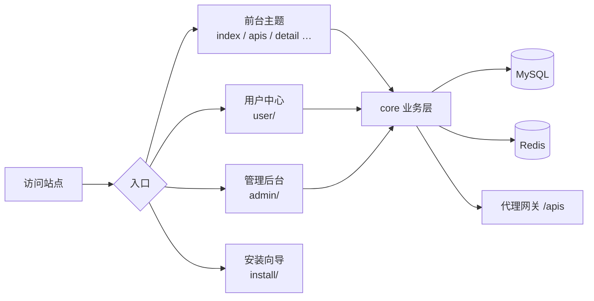

<div align="center">
  <h1>APINEXUS</h1>
</div>

<p align="center">
  <strong>开放接口平台 · 自部署管理 · 云端在线更新</strong>
</p>

<p align="center">
  
  
  <a href="https://gitee.com/xunjinlu/apinexus"></a>
  <a href="https://gitcode.com/xunjinlu/apinexus"></a>
  <a href="https://github.com/whr884657/apinexus"></a>
  
  
</p>

---

## 项目简介

**ApiNexus** 是可自部署的开放 API 接口平台：前台目录与在线调试、后台审核与分类、用户令牌与积分、双主题与云端在线更新。基于 PHP + MySQL，无重型框架依赖。

**主要能力：**

- 六步 Web 安装；管理员 / 用户双端登录（含邮箱验证码与 QQ、Gitee）
- 接口审核、分类、代理网关、调用统计与令牌
- 积分充值与订单；前台双主题；后台控制台与数据大屏
- 行为验证、AI 文档辅助、云端在线更新

更多界面与交互约定见仓库内开发规范文档。

---

## 代码仓库与下载

| 平台 | 链接 | 说明 |
|------|------|------|
| **Gitee** | [xunjinlu/apinexus](https://gitee.com/xunjinlu/apinexus) | 主仓库 |
| **GitCode** | [xunjinlu/apinexus](https://gitcode.com/xunjinlu/apinexus) | 同步仓库 |
| **GitHub** | [whr884657/apinexus](https://github.com/whr884657/apinexus) | 同步仓库 |
| **发行版下载** | [Gitee Releases](https://gitee.com/xunjinlu/apinexus/releases) | 完整安装包 |

压缩包命名：`apinexus{版本号}.zip`（如 `apinexus13.26.18.zip`）。完整版本历史见 **[更新记录.md](更新记录.md)**。

---

## 后台框架特性

- 自定义 PHP 架构，无 Laravel / ThinkPHP 等重型依赖
- 白色后台：顶栏 + 可收缩分组侧边栏；电脑端可收起，手机端侧滑
- 统一大弹窗与 Toast；会话超时可配置
- 系统名称、Logo、站点信息等可在后台配置；源码可二次开发

---

## 环境要求

- **PHP** 7.4 / 8.0 / 8.2（推荐 8.0+）
- **MySQL** 5.7+ 或 MariaDB 10.3+
- **PHP 扩展**：pdo、pdo_mysql、**redis**、mbstring、json、session、curl、openssl、zip
- **目录权限**：`config/`、`data/` 可写；安装后自动生成 `config/database.php`

### 结构示意

不在此展开逐文件清单。核心类说明见 **[CORE模块说明.md](CORE模块说明.md)**。



---

## 安装说明

1. 上传代码到 Web 服务器（或 `git clone` 后部署）
2. 确保 `config/` 目录可写
3. 创建 MySQL 空数据库
4. 访问 `https://你的域名/install/` 完成六步安装（先配 Nginx 伪静态）
5. 安装完成后访问 `/admin/login.php` 登录后台

---

## 伪静态 / URL 重写

> **权威规则以根目录 [`nginx伪静态配置.md`](nginx伪静态配置.md) 情况 A 为准**，须与安装向导、根目录 `.htaccess`、本段保持一致。改规则时四处同步（含 `/sitemap.xml`）。根目录**不再提供** `robots.txt`（避免 Disallow 暴露目录结构）。

### Apache

项目根目录 `.htaccess` 已含：禁止直链 `config/`、`data/`；`/apis/{短码}` 代理；`/sitemap.xml`；通用 `/{页面}/{数字ID}` → `/{页面}.php?id=`。启用 `mod_rewrite` 即可。

### Nginx（宝塔「伪静态」请只粘贴英文规则，不要带中文注释）

**推荐整段粘贴（情况 A，与安装向导默认一致）：**

```nginx
location ~ ^/(config|data)/ {
    deny all;
    return 403;
}
location ~ ^/apis/([a-z0-9]+)/?$ {
    rewrite ^/apis/([a-z0-9]+)/?$ /apis.php?_vs_slug=$1 last;
}
location = /sitemap.xml {
    rewrite ^ /sitemap.php last;
}
location ~ ^/([a-z0-9_-]+)/([0-9]+)/?$ {
    rewrite ^/([a-z0-9_-]+)/([0-9]+)/?$ /$1.php?id=$2 last;
}
location / {
    try_files $uri $uri/ $uri.php$is_args$args;
}
```

| 顺序 | 规则 | 作用 |
|------|------|------|
| 1 | `config` + `data` 合并 deny | 禁止直链配置与运行时目录 |
| 2 | `/apis/{短码}` | 代理网关 |
| 3 | `/sitemap.xml` | 站点地图 |
| 4 | `/{页面}/{数字}` | 路径式资源 → `?id=` |
| 5 | `location /` | 去 `.php` |

若站点已有 `location /`，可只追加上表 1～4 段并放在其**上面**。

> **注意：** 不要写 `[a-z0-9]{3,64}` 等带花括号量词（宝塔可能吞掉 `{…}`）。  
> **注意：** 必须 rewrite 到 `/$1.php?id=$2`，不要 PATH_INFO。  
> **勿伪静态：** 码支付回调 `core/play/codeplay/notify.php` / `return.php` 须直访。

完整说明见 [`nginx伪静态配置.md`](nginx伪静态配置.md)。

---

## 在线更新

登录后台后会向云端检测最新版本。若本地低于云端，可在「系统升级」中安装。

**更新过程（分步）：** 下载 → 解压 → 覆盖系统文件（**不替换**数据库配置与安装锁定、**不覆盖**运行时数据目录）→ 如有则执行增量库结构 → 清理临时文件。

**服务器要求：** 支持解压的 PHP 扩展、可写项目目录、可访问云端。

---

## 版本记录

> 此处**仅保留最新一条**；完整历史见 **[更新记录.md](更新记录.md)**。

### v13.26.18（2026-08-21）

- **安装 / 控制台 / 列表 / 订单：** 检测页合并分组；TOP 手动滚动；底栏对齐积分变动；订单标题行刷新
- **主题二：** 横向 Tab 详情、公告与专属 Markdown、仅「复制 Markdown」（slate 2.21.0）
- **README：** 精简简介与结构示意；去掉冗长目录树与「安全实测与共建」
- **全站：** 浏览器控制台固定品牌信息（项目名 / 简介 / 开发者 / 版本 / 三仓色块链接 / 寄语；主题不可改）
- **更多：** 见 [`更新记录.md`](更新记录.md)

---

## 开源协议

本项目采用 **[MIT License](LICENSE)**。中文补充说明见 **[LICENSE.zh-CN.md](LICENSE.zh-CN.md)**（安装向导首次进入时须阅读确认）。

### 您可以

- 学习研究、个人使用、商业使用
- 修改并再发布（须保留版权声明与 MIT 许可全文）

### 作者声明（免责）

- 本项目按 **「原样（AS IS）」** 提供，**不提供任何明示或暗示的担保**
- 因使用本项目产生的损害，**作者不承担责任**
- 使用者应自行评估安全风险，做好备份、加固与合规审查
- 详细条款以 **[LICENSE](LICENSE)** 与 **[LICENSE.zh-CN.md](LICENSE.zh-CN.md)** 为准

---

## 作者与仓库

- 开发者个人站：[www.xunjinlu.fun](https://www.xunjinlu.fun/)
- Gitee：[https://gitee.com/xunjinlu/apinexus](https://gitee.com/xunjinlu/apinexus)
- GitCode：[https://gitcode.com/xunjinlu/apinexus](https://gitcode.com/xunjinlu/apinexus)
- GitHub：[https://github.com/whr884657/apinexus](https://github.com/whr884657/apinexus)
- 问题反馈：可通过任一仓库 Issues 提交

---

> 维护者本地文档（README 编写要点、发版检查清单等）不随仓库发布，请在本地查阅。
