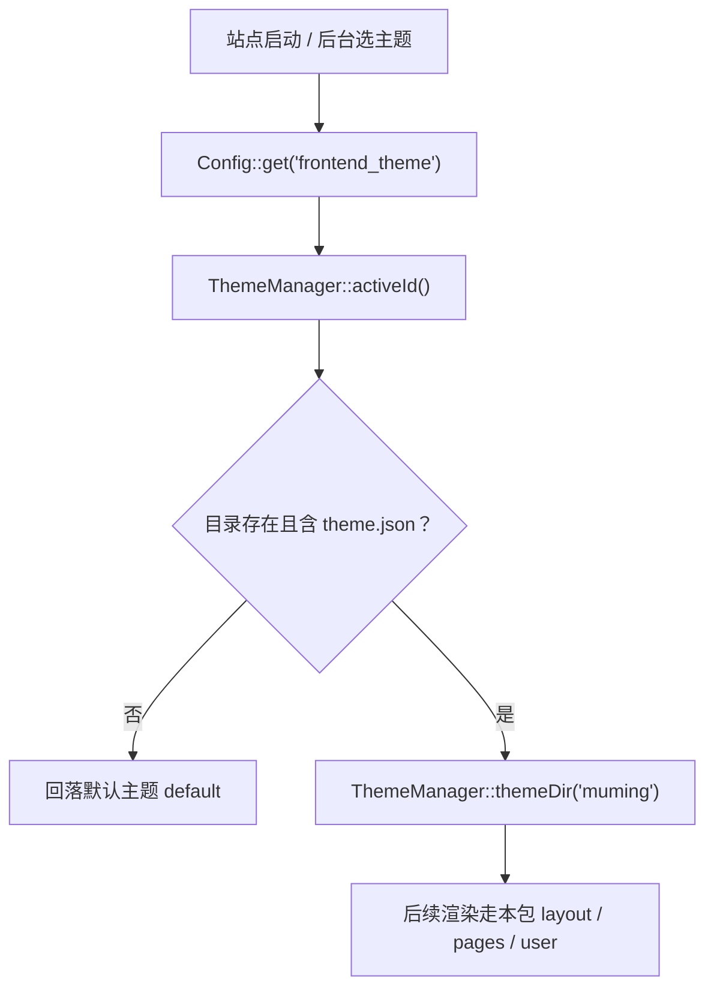
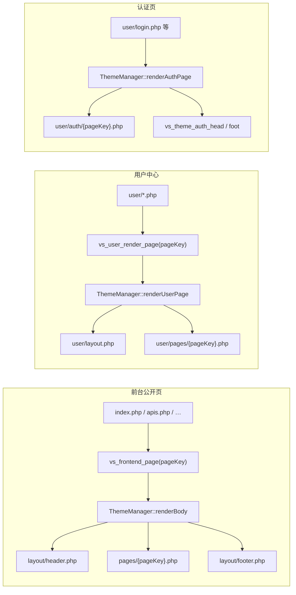
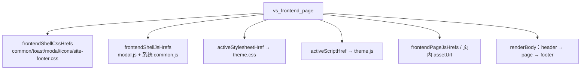
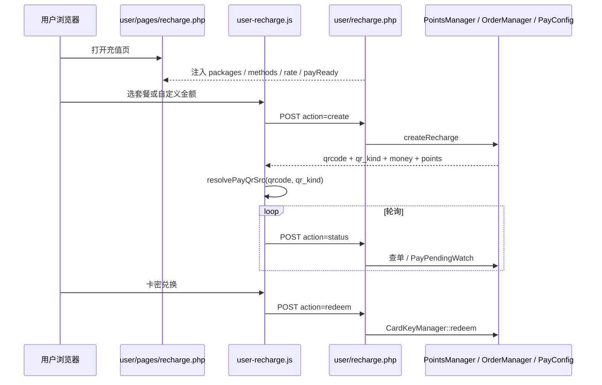
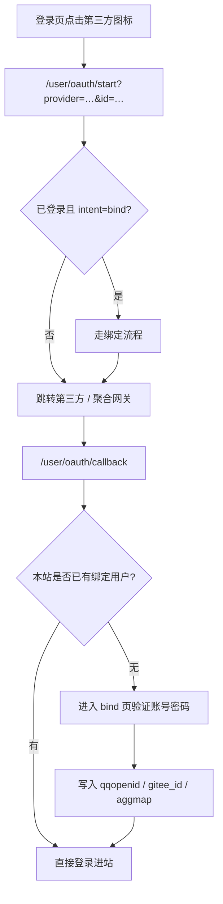
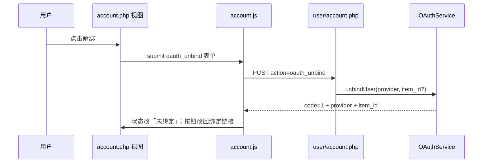
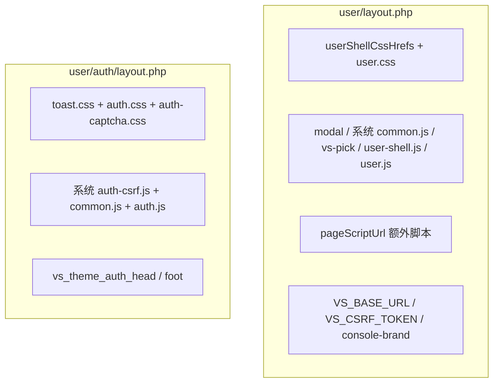

# ApiNexus · 慕名主题规范（muming）

> **这份规范随主题包走。** 目录：`core/theme/muming/`。改版、对接、维护本主题时以本文为准。  
> 维护者本地还有一份同文：`开发规范/主题六规范.md`（不进安装包）。两边改动必须一起改。  
> **正式名称：慕名（英文 ID：`muming`）。** 后台卡片对外名可仍显示「主题6」，规范与文档一律称 **慕名 / muming**，勿再称作「主题六规范」正文标题。  
> 开发者：慕名。定位：七牛云式浅色企业蓝 SaaS。  
> class 前缀：`th5-*`（历史 fifth 前缀保留，禁止改成 `st-*` / `th3-*`）。  
> 原主题五 `fifth` 已下线；曾启用 `fifth` 的站点请改选本主题。  
> **主题包修改流程：** 同目录 [`修改流程记录.md`](修改流程记录.md)（随包；与仓库 `修改流程记录/` 互补）。

---

## 一、这是谁、怎么跑起来

### 1.1 身份

| 项 | 值 |
|----|-----|
| 主题 ID（强制） | `muming`（`theme.json` → `id`，与目录名一致） |
| 正式名 | **慕名** |
| 资源根 | `core/theme/muming/` |
| 后台设置渲染函数 | `vs_theme_admin_render_settings_muming`（`lib/admin-settings.php`） |
| 配置存储 | `core/data/muming/theme.db`（v13.26.45+）；当前主题 ID 仍在 MySQL `frontend_theme` |

### 1.2 核心如何发现并启用本主题

- 合法 ID 正则：`^[a-z0-9][a-z0-9_-]{0,31}$`
- 后台切换：`admin/system/theme.php` → `ThemeManager::setActive('muming')`
- 主题设置面板：同页「主题设置」→ `vs_admin_render_theme_config_fields('muming')` → 调用本包 `vs_theme_admin_render_settings_muming`

### 1.3 三条渲染链（前台 / 用户中心 / 认证）

渲染时核心会定义 `VS_THEME_RENDER`；主题 PHP **禁止**在未定义该常量时被直接访问（文件头 `exit`）。

---

## 二、目录结构与职责

| 路径 | 职责 |
|------|------|
| `theme.json` | 元数据 + settings schema（后台表单据此生成） |
| `主题规范.md` | **本文**（随包） |
| `pages/` | 前台页面体：`home` / `apis` / `detail` / `articles` / `about` / `links` / `applylink` / `contributors` / `profile` / `sponsor` |
| `layout/` | 前台壳：`header.php`、`footer.php` |
| `lib/bootstrap.php` | 主题公共函数：`TH5_md_render`、`TH5_footer_social_*`、`TH5_emit_console_brand_script` 等 |
| `lib/admin-settings.php` | 后台主题配置 UI |
| `api/` | 主题自有 HTTP：`sitemeta.php`、`ad-upload.php`（独立 bootstrap，**不是** ThemeManager 渲染） |
| `user/layout.php` | 用户中心壳 |
| `user/auth/` | `login` / `register` / `forgot` / `bind` + `layout.php` |
| `user/pages/` | 登录后业务视图 |
| `assets/theme.css` + `theme.js` | 前台主样式 / 主脚本 |
| `assets/css/tw-compat.css` | 被 `theme.css` `@import` |
| `assets/auth.css` / `auth-captcha.css` / `auth.js` | 认证页 |
| `assets/user.css` / `user.js` | 用户中心 |
| `assets/shell/` | 壳 CSS/JS；**注意：`common.js` 主题包副本不生效**，系统强制加载根目录 `assets/js/common.js` |
| `assets/js/` | 页脚业务脚本（`user-*.js`、`account.js`、`pages/*` 等） |
| `assets/img/` | 社交图标、广告图目录 `ad/` 等 |
| `preview.png` | 后台主题卡预览 |

**铁律：** 资源只出本包 `assets/`。禁止从 default / slate / three / docs 整段搬 HTML/CSS 改色。禁止擅自替换主题包内图片。

---

## 三、前台页面 ↔ 核心接口对照

统一形态：站点根 `*.php` → `vs_frontend_page('pageKey', …)` → 本包 `pages/{pageKey}.php`。

| 主题文件 | 路由 / 入口 | pageKey | 调用的核心能力（类 / 函数） | 实现功能 |
|----------|-------------|---------|------------------------------|----------|
| `pages/home.php` | `/` ← `index.php` | `home` | `SiteContext`；`FrontendStats`；`FrontendCategory::listTags`；`FrontendAnnouncement::listForTheme` / `listPopups`；`PayConfig::packages`；`ThemeManager::themeSetting*`；`TH5_md_render`；`VS.fetchFrontCatalog` → `/core/front/catalog.php` | 首页统计、分类标签、API 预览、公告条/弹窗、广告轮播、套餐展示 |
| `pages/apis.php` | `/apis` | `apis` | 同上部分 + `api_sort` / `api_new_days` | 全部接口列表 |
| `pages/detail.php` | `/detail/{id}` | `detail` | 入口已 `FrontendApi::findForThemeById`、`vs_playground_session_context`、`FrontendFeedback`；主题内 `FrontendApi::billingLabel` / `prettyParamsJson` / `pickRandomRecommend`；`AuthSecurity::csrfToken`；`Markdown`（经 `TH5_md_render`） | 接口详情、在线测试、OpenAPI、复制、推荐 |
| `pages/articles.php` | `/articles` | `articles` | `FrontendArticle`；`FrontendComment`；`FrontendUser::current`；`AuthSecurity::csrfToken`；入口 POST `FrontendComment::submit` | 文章列表/详情/评论 |
| `pages/about.php` | `/about` | `about` | 入口 `FrontendAbout::getBoundArticle`；`SiteContext`；`TH5_md_render` | 关于页 |
| `pages/links.php` | `/links` | `links` | `FrontendLink::listForThemePage` | 友情链接 |
| `pages/applylink.php` | `/applylink` | `applylink` | `FrontendLink::siteCard`；`AuthSecurity::csrfToken`；入口 `LinkManager::apply`；本包 `api/sitemeta.php` | 申请友链 + 一键抓 TDK |
| `pages/contributors.php` | `/contributors` | `contributors` | `FrontendContributor::listForTheme` | 贡献者列表 |
| `pages/profile.php` | `/profile/{id}` | `profile` | 入口 `FrontendContributor::findProfile`；`core/ping.php`（延迟） | 贡献者个人主页 |
| `pages/sponsor.php` | `/sponsor` | `sponsor` | `FrontendSponsor::paymentQrs` / `listForTheme` | 赞助页 |

### 布局层

| 文件 | 核心对接 | 功能 |
|------|----------|------|
| `layout/header.php` | `ThemeManager::navItems()`；`SiteContext`；`UserAuth` + `UserAvatar`；`vs_render_theme_seo_block` | 顶栏、登录/控制台、主题切换、SEO |
| `layout/footer.php` | `SiteContext::beianInfo`；`show_runtime`；`TH5_render_footer_social()`；`SiteMedia::imgUrl('gov.png')` | 备案、运行时间、社交图标 |

导航 ID（与 pageKey 对齐）：`home` / `apis` / `articles` / `contributors` / `links` / `sponsor` / `about`。
顶栏 / 页脚导航列只渲染 `ThemeManager::navItems()`（已按 `nav_show_*` 过滤，默认全开）；禁止硬编码七项绕过。关闭入口不影响 SEO（sitemap / 直达仍可用）。

### 前台资源注入流程

页内常见自挂：`ThemeManager::assetUrl('muming', 'assets/js/pages/…')`。版本查询：`?v=` + `VS_VERSION`。

---

## 四、用户中心 ↔ 核心路由

路由在 `user/`，视图在本包 `user/pages/`；经 `vs_user_render_page` → `ThemeManager::renderUserPage`。

| 核心路由 | pageKey | 主题文件 | 主题脚本 | 核心能力 | 功能 |
|----------|---------|----------|----------|----------|------|
| `/user/index` | `dashboard` | `dashboard.php` | `user-dash-hello.js`、`user-dashboard.js`、可选 `user-checkin.js` | `FrontendUser::dashboardStats` / `doCheckin` / `checkinBanner`；`UserAvatar`；`UserDashHello::pick` | 控制台、签到 |
| `/user/api-manage` | `apimanage` | `apimanage.php` | `icon-picker.js`、`api-params-editor.js`、`vs-syntax.js`、`user-api-manage.js` | 入口层发布；`Markdown::renderAssetsHtml` | 开发者 API 管理 |
| `/user/keys` | `keys` | `keys.php` | `user-keys.js` | 入口令牌 CRUD | 密钥管理 |
| `/user/logs` | `logs` | `logs.php` | 根目录 `assets/js/user-logs.js`（系统级，E363） | 入口查询 | 调用日志（UI 对齐管理端） |
| `/user/recharge` | `recharge` | `recharge.php` | `user-recharge.js` | 见第五节 | 充值 / 卡密 |
| `/user/points` | `points` | `points.php` | `user-points.js` | `PayConfig::fmtPoints` | 积分流水 |
| `/user/ip` | `ip` | `ip.php` | `user-ip.js` | 入口配置 | IP 白名单 |
| `/user/account` | `account` | `account.php` | `account.js` | `UserAuth::updateAccount`；`UserAvatar`；`OAuthService::*`；`AuthSecurity::csrfToken` | 资料 + 第三方绑定 |

侧栏：`ThemeManager::userMenuGroups()`（开发者才显示 API 管理：`UserRole::currentCanPublishApi`）。

### 认证页

| 核心路由 | pageKey | 主题文件 | 核心能力 |
|----------|---------|----------|----------|
| `/user/login` | `login` | `user/auth/login.php` | `AuthSecurity` 邮件 ticket；`Captcha`；`OAuthService::loginButtons`；`RegisterPolicy`；`SiteMedia` |
| `/user/register` | `register` | `register.php` | 注册邮件 / 人机验证 |
| `/user/forgot` | `forgot` | `forgot.php` | 找回密码 |
| `/user/oauth/bind` 等 | `bind` | `bind.php` | OAuth 首次绑定账号密码 |

登录字段顺序遵守《登录认证表单顺序规范》。未登录顶栏「登录 / 注册」，已登录「控制台」。

---

## 五、充值页对接（含 v13.26.45 / E345·E347）

| 层 | 职责 |
|----|------|
| `user/recharge.php`（核心） | `create` / `status` / `cancel` / `redeem`；注入 `PayConfig::*` |
| `user/pages/recharge.php`（本包） | UI：套餐卡、支付方式、自定义金额弹窗、扫码弹窗 |
| `assets/js/user-recharge.js` | `VS.postForm`；`resolvePayQrSrc` 处理 `qr_kind=image`（E345）；自定义金额只改 `#rechargeCustomHintPts`（E347） |

**E347 强制：**

- `#rechargeCustomOverlay` 脚栏取消 / 「确认并支付」同高（样式在 `assets/shell/user-shell.css`）
- 预计到账用 `.vs-notice.vs-notice--tip` + `#rechargeCustomHintPts`，禁止再用 `.vs-form-hint` 淡灰一行字

主题**不直连**支付网关，只渲染 + 对本页 AJAX。

---

## 六、聚合登录 / 第三方登录（v13.26.45 / E348）★ 维护重点

> 完整业务规则见仓库《聚合登录开发规范》。本节只写 **慕名主题侧必须怎么接**。

### 6.1 核心注入什么（主题只画 UI）

| 变量 | 来源 | 含义 |
|------|------|------|
| `$oauthProviders` | `OAuthService::enabledProviders()` | `['qq'=>bool,'gitee'=>bool]`（**不含 agg**） |
| `$oauthButtons` | 登录：`loginButtons()`；账号：`accountButtons($uid)` | **唯一推荐渲染源**（官方 + 聚合） |
| `$oauthBindings` | `bindingsForUser($uid)` | `qq`/`gitee` bool；`agg` 为 `item_id => bool` |
| `$oauthError` | Session Flash（`vs_flash_take`） | 错误文案；**禁止** URL `?oauth_error=` |

登录按钮字段：`provider` / `item_id` / `label` / `icon` / `url`  
账号按钮字段：另有 `bound` / `bind_url`（无 `url`）

### 6.2 URL 与解绑约定

| 场景 | URL / 表单 |
|------|------------|
| QQ / Gitee 登录 | `/user/oauth/start?provider=qq` 或 `gitee` |
| 聚合登录 | `/user/oauth/start?provider=agg&id={item_id}`（查询参数名是 **`id`**） |
| 绑定 | 同上 + `&intent=bind` |
| 解绑 POST | `action=oauth_unbind` + `provider` +（`agg` 时）表单字段 **`item_id`** + `csrf_token` → `user/account.php` |

图标统一：`SiteMedia::imgUrl('oauth/….svg')`（系统 `assets/img/oauth/`）。

### 6.3 本包必须改动的文件

| 文件 | 要求 |
|------|------|
| `user/auth/login.php` | `foreach ($oauthButtons)` 输出图标；空时回退 qq/gitee |
| `user/pages/account.php` | `foreach ($oauthButtons)`；`agg` 解绑带 hidden `item_id` |
| `assets/js/account.js` | 解绑成功后按 `data.item_id` 重建绑定链（`provider=agg&id=…&intent=bind`） |

**禁止：** 写死只判断 `$oauthProviders['qq']` / `gitee`；解绑后只拼 qq/gitee 链接。

### 6.4 登录 → 回调 → 绑定流程图

### 6.5 账号页解绑流程

---

## 七、主题自有 API

### 7.1 `api/sitemeta.php`

| 项 | 说明 |
|----|------|
| 作用 | 友链申请「一键获取」站点 TDK |
| 核心 | `LinkSiteMeta::fetch`；`AuthSecurity::rateLimitAllow('front_sitemeta_ip:…')`；`AjaxResponse` |
| URL | `{站点根}/core/theme/muming/api/sitemeta.php` |
| 调用方 | `pages/applylink.php` → `assets/js/pages/applylink.js` |

### 7.2 `api/ad-upload.php`

| 项 | 说明 |
|----|------|
| 作用 | 首页广告图上传到 `assets/img/ad/` |
| 核心 | `vs_require_secure_post`；IP 频控；jpg/png/gif/webp ≤2MB |
| URL | `{站点根}/core/theme/muming/api/ad-upload.php` |
| 调用方 | `lib/admin-settings.php` 内嵌上传 JS |

---

## 八、主题设置 keys（`theme.json` → `core/data/muming/theme.db`）

读写：`ThemeManager::themeSetting` / `themeSettingStr` / `themeSettingBool` / `themeSettingInt`。

### 8.1 首页与列表

| key | 用途 |
|-----|------|
| `stats_num_format` | 累计调用 `full` / `compact` |
| `home_preview_limit` | 首页 API 预览条数 |
| `api_sort` | `default` / `time` / `calls` |
| `api_new_days` | 「上新」天数 |
| `show_home_announce` | 公告条 + 弹窗总开关 |
| `show_runtime` | 页脚运行时间 |

### 8.2 首页广告（最多 4 槽）

`home_ad_enabled`、`home_ad_interval`；`home_ad_{1..4}_{enabled,type,image,badge,title,desc,link,button_text}`。  
渲染：`home.php` → `home-ad-carousel.js`。

### 8.3 页脚社交（最多 3 个）

`footer_social_{1..3}_{type,value,qq_mode}`；类型：空 / wechat / qq / email / github / gitee / twitter。  
组装：`TH5_footer_social_items()` → `TH5_render_footer_social()`。

### 8.4 公告

- 开关：`show_home_announce`
- 内容：**不是** theme setting，来自 `FrontendAnnouncement::*`
- 无已发布公告或关掉开关：**不输出**滚动条、弹窗和脚本（禁止写死欢迎占位）
- class：`th5-announce-*`；弹窗打开前挂 `document.body`；禁止整卡贴顶；禁止手机正文 `max-height: none`

---

## 九、用户中心 / 认证资源加载

---

## 十、核心对接速查表

| 能力 | 典型入口 |
|------|----------|
| 主题切换 / 读设置 | `ThemeManager`；`admin/system/theme.php` |
| 前台页面 | `vs_frontend_page` → `renderBody` |
| 用户页 | `vs_user_render_page` → `renderUserPage` |
| 认证页 | `ThemeManager::renderAuthPage` |
| 站点信息 | `SiteContext` |
| 前台数据 | `Frontend*`（Api / Stats / Category / Announcement / Article / Comment / Link / Sponsor / Contributor / About / User / Feedback） |
| 安全 | `AuthSecurity`、`Captcha`、`vs_require_secure_post` |
| 头像 | `UserAvatar` |
| 支付积分 | `PayConfig`、`PointsManager`、`OrderManager`、`CardKeyManager` |
| OAuth | `OAuthService` / `OAuthConfig` / `AggOAuth`；路由 `user/oauth/*` |
| 目录 API | `/core/front/catalog.php` |
| Markdown | `TH5_md_render` 或 `/core/markdown/assets/*` |

---

## 十一、改这个主题时的检查清单

- [ ] 只改 `core/theme/muming/`（聚合登录图标走系统 `assets/img/oauth/` 除外）
- [ ] 没有从其它主题复制整页结构
- [ ] 登录 / 账号使用 `$oauthButtons` 循环（含 `agg` + `item_id`）
- [ ] `account.js` 解绑后能重建聚合绑定链接
- [ ] 充值自定义金额：tip + `#rechargeCustomHintPts`；`resolvePayQrSrc` 认 `qr_kind`
- [ ] 没配公告时首页没有滚动条和弹窗
- [ ] `theme.json` 新键已画进 `vs_theme_admin_render_settings_muming`
- [ ] 本文与 `开发规范/主题六规范.md` 一起改
- [ ] 未擅自替换主题包内图片

---

**最后更新：** 2026-09-22（v13.26.45：聚合登录 E348 + 充值 E345/E347 对齐；规范正名为慕名 / muming）
